# 快速使用

## 准备工作

### 硬件

​		推荐使用NextPilot自研飞控产品，整套硬件包括导航飞控计算机（简称飞控）、空速计、基准站、调试接口板与配套线缆等。目前我们推出的一款工业级导航飞控产品[NP-FMU-H05](#20-产品NP-H50)，飞控产品如下图所示：

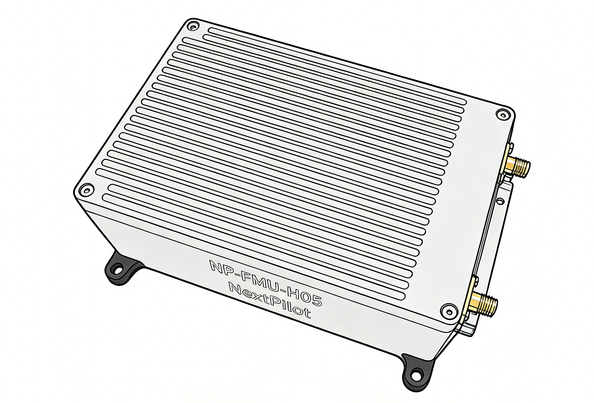

​		关于NP-H05系列产品介绍请参考[产品文档](XXX)，包括系统组成、功能性能。

> **重要说明**
>
> - 目前支持的飞控硬件只有我们一款产品，后续计划支持更多开源硬件；

​		另外根据需要准备一个无人机飞行平台，当前飞控支持有多旋翼、固定翼、VTOL三大类机型。

### 地面站

​		下载并安装我们产品自带的[地面站软件](XXX)，具体安装参见[地面站安装指导文档](XXX)。

> 注意，虽然飞控默认支持mavlink协议，可以选用QGC进行通信连接与基本控制，但由于飞控功能模块、业务逻辑与PX4并不完全一样，故无法使用QGC进行完整的参数配置与功能控制。

### 烧写固件

​		飞控出厂默认烧写了最新固件，如果需要更换固件版本，可以从[这里下载](https://e.gitee.com/nextpilot/repos/nextpilot/nextpilot-user-assets/sources)。

​		准备好固件后，参考[地面站软件使用手册](XXX)中固件升级章节。

## 安装

### 坐标系定义

​		机体坐标系定义：以无人机重心为原点，机头前方为X轴，机身右侧为Y轴，下方为Z轴。如下图所示：

​		飞控坐标系定义：以飞控中心为原点，以连接器所在位置为后，飞控前侧为X轴，右侧为Y轴，下方为Z轴。飞控外壳印有坐标轴，如下图所示：

### 飞控安装

​		在安装条件允许情况下，应将飞控安装至无人机重心位置，使飞控坐标系与无人机坐标系重合。

​		若无法安装在无人机重心，则需要设置飞控在机体平台上的安装位置偏移量。安装位置定义：飞控原点在机体坐标系下的坐标。对应参数为：EKF2_IMU_POS_X，EKF2_IMU_POS_Y，EKF2_IMU_POS_Z。

​		如果坐标系无法重合，需根据实际安装条件对应调整飞控安装角度，安装角度定义：以机体坐标系为参考，飞控坐标系相对于机体坐标系的旋转角度，对应参数为SENS_BOARD_ROT。

​		对于几种典型安装，对应的旋转角度、安装位置配置如下表所示：

| 安装示例                            | 旋转角度                    | 安装位置                                                     |
| ----------------------------------- | --------------------------- | ------------------------------------------------------------ |
|  | 无旋转ROTATION_NONE         | EKF2_IMU_POS_X=0.3 EKF2_IMU_POS_Y=0 EKF2_IMU_POS_Z=0 |
|  | 顺时针转90°ROTATION_YAW_90  | EKF2_IMU_POS_X=0 EKF2_IMU_POS_Y=0.3 EKF2_IMU_POS_Z=0 |
| 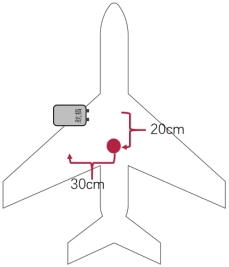 | 逆时针转90°ROTATION_YAW_270 | EKF2_IMU_POS_X=0.2 EKF2_IMU_POS_Y=-0.3 EKF2_IMU_POS_Z=0 |

### 卫星天线安装

​		默认卫星主天线在后，副天线在前，由主天线到副天线的方向是与机头方向一致，若不一致，则需要设置旋转角度。旋转角度定义：主天线到副天线连成向量与机体坐标系X轴夹角（目前默认仅支持在水平面进行旋转），顺时针旋转为正。对应参数为GPS_YAW_OFFSET。

​		默认卫星主天线安装在无人机重心，若不在重心，则需要设置主天线位置，对应参数为：EKF2_GPS_POS_X，EKF2_GPS_POS_Y，EKF2_GPS_POS_Z。安装位置定义：主天线所在机体坐标系下的坐标。

​		对于几种典型安装，对应的旋转角度、安装位置配置如下表所示：

| 安装示例              | 旋转角度           | 安装位置                                                     |
| --------------------- | ------------------ | ------------------------------------------------------------ |
| 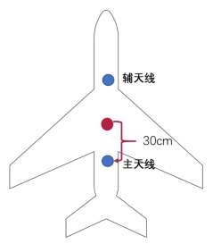 | GPS_YAW_OFFSET=0   | EKF2_GPS_POS_X=-0.3 EKF2_GPS_POS_Y=0.0 EKF2_GPS_POS_Z=0.0 |
| 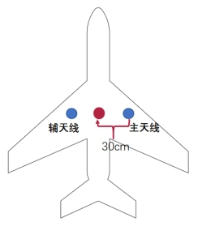 | GPS_YAW_OFFSET=270 | EKF2_GPS_POS_X=0.0 EKF2_GPS_POS_Y=0.3 EKF2_GPS_POS_Z=0.0 |
| 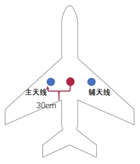 | GPS_YAW_OFFSET=90  | EKF2_GPS_POS_X=0.0 EKF2_GPS_POS_Y=-0.3 EKF2_GPS_POS_Z=0.0 |

## 设备连接

### 机架与输出

​		无人机执行器一般包括舵机、电调电机、发动机等，驱动信号一般为PWM。飞控提供了共计32路PWM输出通道，根据不同机型，需要对应连接。

​		关于不同机型具体对应的机架在[机架设置](#机架设置)章节。

#### 四旋翼X型机架

| 机架描述                             | 参数                 | 引脚定义                                                     |
| ------------------------------------ | -------------------- | ------------------------------------------------------------ |
| 四旋翼X型机架                        | SYS_AUTOSTART=137001 | FCS_CH1：右前电机； FCS_CH2：左后电机； FCS_CH3：左前电机； FCS_CH4：右后电机；  |
|  |                      | 电机旋转方向如左图所示。 右前电机：逆时针； 左后电机：逆时针； 左前电机：顺时针； 右后电机：顺时针；  |

#### 六旋翼X型机架

| 机架描述                                                     | 参数                 | 引脚定义                                                     |
| ------------------------------------------------------------ | -------------------- | ------------------------------------------------------------ |
| 六旋翼X型机架                                                | SYS_AUTOSTART=137010 | FCS_CH1：右前电机/电机5； FCS_CH2：右中电机/电机1； FCS_CH3：右后电机/电机4； FCS_CH4：左后电机/电机6； FCS_CH5：左中电机/电机2； FCS_CH6：左前电机/电机3；  |
| 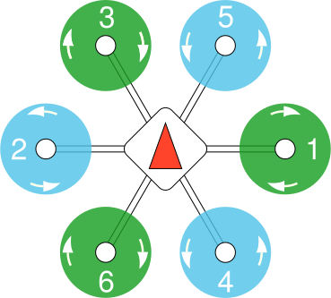 |                      | 电机旋转方向如左图所示。                                |

#### 电动VTOL标准机架

| 机架描述                                             | 参数                 | 引脚定义                                                     |
| ---------------------------------------------------- | -------------------- | ------------------------------------------------------------ |
| 电动VTOL标准机架 含左右副翼、水平尾翼和垂直尾翼 | SYS_AUTOSTART=138001 | FCS_CH1：右前电机； FCS_CH2：左后电机； FCS_CH3：左前电机； FCS_CH4：右后电机； FCS_CH5：前拉/尾推电机； FCS_CH9：左副翼舵机； FCS_CH10：右副翼舵机； FCS_CH11：升降舵机； FCS_CH12：方向舵机；  |
|                   |                      |                                                              |

#### 油动VTOL-倒V尾

| 机架描述                                         | 参数                 | 引脚定义                                                     |
| ------------------------------------------------ | -------------------- | ------------------------------------------------------------ |
| 油动VTOL-倒V尾 含左右副翼、左V尾翼和右V尾翼 | SYS_AUTOSTART=139002 | FCS_CH1：右前电机； FCS_CH2：左后电机； FCS_CH3：左前电机； FCS_CH4：右后电机； FCS_CH9：左副翼舵机； FCS_CH10：右副翼舵机； FCS_CH11：左V尾舵机； FCS_CH12：右V尾舵机；  |
|                                                  |                      | 电机旋转方向为： 右前电机：逆时针； 左后电机：逆时针； 左前电机：顺时针； 右后电机：顺时针；  |

## 地面站通信连接

### 准备数据链

​		可选择市面上常见的数传、图传（带网口或串口）即可。

### 通信连接

​		可通过点击“添加”按钮，创建新的通信连接，输入名称、选择协议、选择接口，根据接口类型输入连接配置即可。

​		所有已创建的通信连接在界面左侧显示。

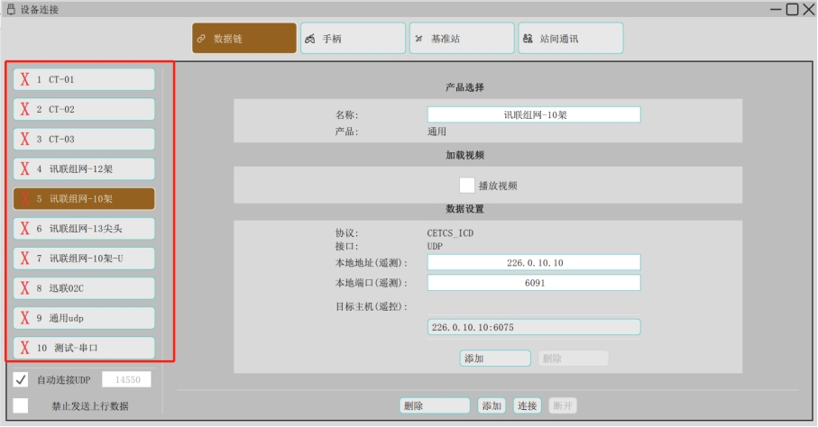 

### 接口类型说明

#### 串口连接

​		串口连接一般在调试时使用较多，插入串口转USB至计算机后，即可选择串口设备，并且设置波特率。

 

图 7 串口通信配置

#### UDP连接

​		UDP连接是实际产品中应用最广泛的连接接口，一般需要设置组播地址、本地端口、目的端口。如下图所示：

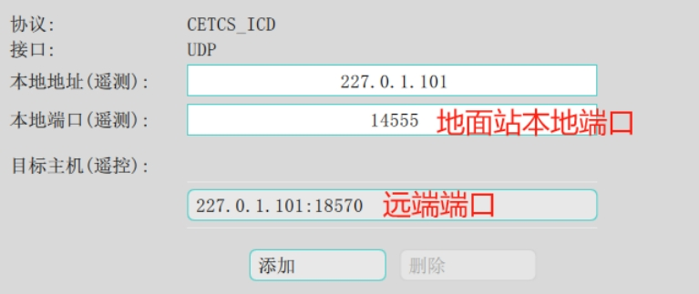 

### 开启连接

​		在已创建的通信连接列表中，点击并选择，然后点击“连接”按钮即可打开通信连接。

​		如果需要连接多架无人机，可以依次选择并打开多个通信连接，地面站会根据无人机ID创建多个实例并显示在主界面。

### 自动连接

​		通过勾选“自动连接”并设置监听端口，可以在地面站软件打开后默认创建UDP连接，一般用于软件在环仿真。

## 基本配置流程

### 机架设置

​		为了更好的支持和适配不同无人机平台，飞控提供了机架参数，不同机架的核心差异在于动力或舵面的数量及位置、布置的不同，例如垂直尾翼与V尾有较大差异、旋翼电机转向不一样等。另外根据机架，对区别较大的飞行参数设置了默认值，例如PID内环参数、盘旋半径、前转换超时时间等。

​		可在飞控设置->机架设置界面选择机架，设置完成后需要重启生效。

​		XXX需要替换

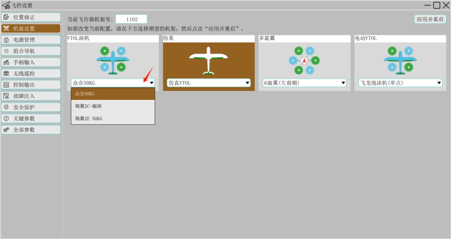 

### 遥控器设置

​		在飞控设置->无线遥控界面进行遥控器设置。

#### 模式设置

​		选择一个绑定至三段拨杆的通道映射至模式通道，默认是使用通道5。

​		默认飞行模式1为手动、飞行模式4为定高、飞行模式6为定点。

#### 校准

​		根据遥控器类型勾选RC模式，点击“开始”按钮，根据提示进行校准即可。

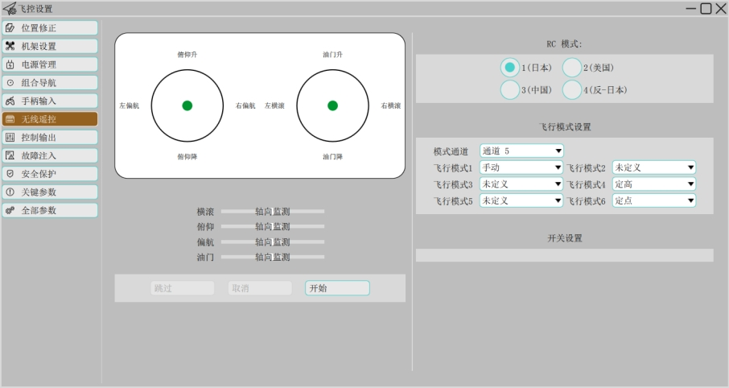

### 电机设置

#### 校准

​		先根据电机产品说明完成校准！

#### 确认电机转向

​		根据[机架设置](#机架设置)，在地面站界面中确认电机转向。

### 舵面反向设置

​		舵面反向设置仅对VTOL、固定翼有效，多旋翼机型忽略。		

​		切至固定翼飞行模态，遥控器解锁后进行舵面控制，若舵面反向，则可通过如下参数设置对应舵面。如果原值为0则改为1，如果原值为1则改为0。

| 参数         | 对应引脚 | 对应设备（根据实际机型确定） |
| ------------ | -------- | ---------------------------- |
| PWM_AUX_REV1 | FCS_CH9  | 左副翼                       |
| PWM_AUX_REV2 | FCS_CH10 | 右副翼                       |
| PWM_AUX_REV3 | FCS_CH11 | 升降/左V尾                   |
| PWM_AUX_REV4 | FCS_CH12 | 方向/右V尾                   |

### 舵面配平设置

​		舵面配平仅对VTOL、固定翼有效，多旋翼机型忽略。

​		切至固定翼飞行模态，遥控器解锁后进行舵面控制，若舵面不在中位，则可以通过以下参数进行调整。

| 参数          | 对应引脚 | 对应设备（根据实际机型确定） |
| ------------- | -------- | ---------------------------- |
| PWM_AUX_TRIM1 | FCS_CH9  | 左副翼                       |
| PWM_AUX_TRIM2 | FCS_CH10 | 右副翼                       |
| PWM_AUX_TRIM3 | FCS_CH11 | 升降/左V尾                   |
| PWM_AUX_TRIM4 | FCS_CH12 | 方向/右V尾                   |

​		注意，参数范围为-0.2~0.2，也就是最多只能调整20%，若舵面偏离过大，则需要进行机械调整。

### 校准电池电压

​		首先使用万用表测量动力电池电压，然后上动力电，进入飞控设置->电源管理界面，输入电池芯数，点击电压分压比计算按钮，输入测量电压后点击计算。

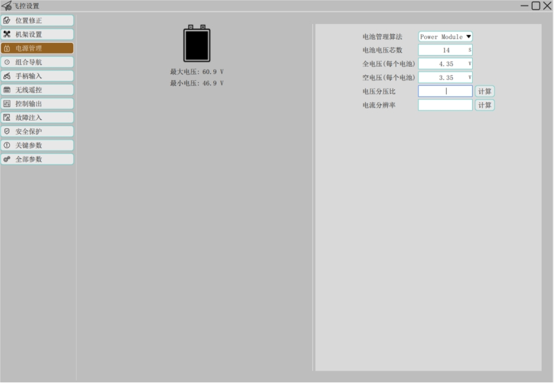

## 基本状态查看

​		安装完成后，将飞控置于空旷无遮挡环境下，获取卫星定位后，可通过地面站查看基本状态。

### 查看惯导

​		点击状态栏惯导图标即可显示惯导状态数据，包括当前所选惯导、工作状态、温度等信息。 

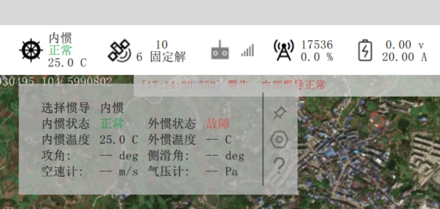

### 查看位置、姿态

​		点击地图上无人机图标，即可显示飞行标签，包括无人机位置、姿态数据，如下图所示： 

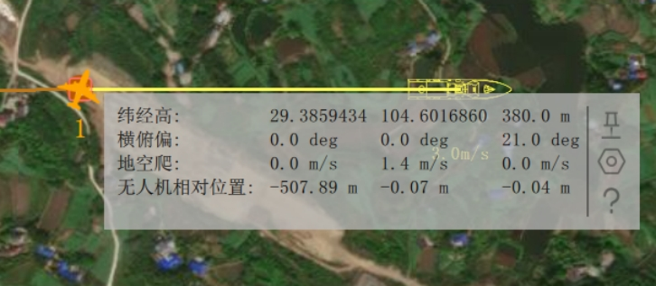

​		另外可以通过点击卫导图标，显示卫导状态数据，可查看当前引导状态（动平台飞行需要）、无人机经纬度、航向、定位类型、卫星数量等信息。

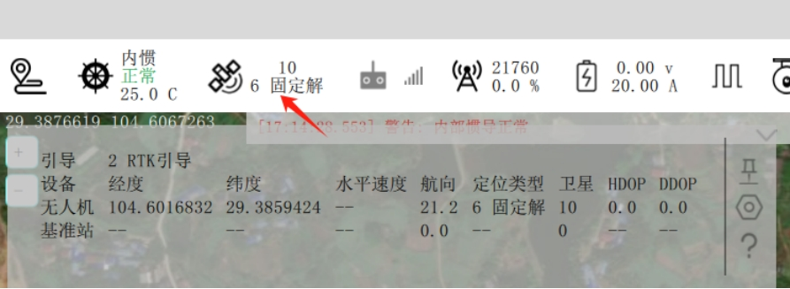

### 查看空速

​		可在飞行标签查看空速，或者在仪表盘查看空速。 

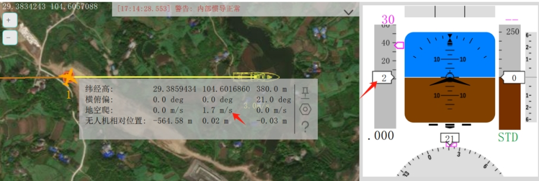

### 查看电压

​		点击状态栏电池图标，即可查看动力电池状态数据，包括电压、剩余电量等。

### 查看飞行数据消息

​		进入调试工具->数据监控界面，可查看飞控下发的所有数据消息，包括消息名称、频率等。

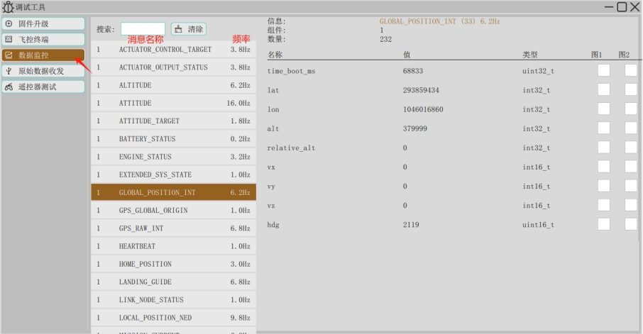

## 基础飞行介绍

### 动力恢复/切断

​		这里动力恢复/切断功能可理解为动力开车/关车，当动力切断后，各驱动器输出中断，切断动作不需要判定条件，立即有效，故也可以用于应急时的受控坠机。

​		默认将动力恢复/切断功能映射至通道7，并且在遥控器上将通道7绑定至一个旋钮开关，即可通过旋钮控制动力恢复/切断。

### 加锁解锁

​		为了保证安全，无人机需要解锁后才能实现动力输出，在上锁状态下，多旋翼动力、舵面、发动机都处于锁住状态。

​		无人机默认上电进行加锁，可通过遥控器或地面站进行解锁操作。

- 通过遥控器解锁：操作遥控器拨杆内八字实现解锁；

- 通过地面站解锁：在“解锁状态”下拉列表中选择解锁，如下图所示：

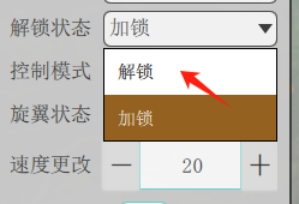

​		然后拉动滑块完成解锁操作确认，如下图所示：

### 飞行模态介绍

​		无人机包括两种飞行模态：多旋翼模态、固定翼模态。两种模态的切换有如下几种方式：

- 通过遥控器切换：通过遥控器8通道实现模态切换，一般在地面做检查时使用，切换至固定翼检查舵面是否正常，切换至多旋翼检查电机是否正常；

- 通过地面站切换：通过地面站“旋翼状态”下拉列表选择飞行模态，如下图所示：

- 自动切换：通过规划任务实现模态切换，例如加入“VTOL垂直起飞”航点实现多旋翼到固定翼切换；

- 外部控制切换：通过外部输入模态切换指令实现，注意这种切换模式需要搭配外部计算机使用。

### 飞行模式介绍

#### 分类

​		无人机支持手动、自动两大类飞行模式。在手动模式下，通过操作遥控设备（如遥控器）给定飞行期望指令，在自动模式下由导航飞控自动生成期望指令。

#### 手动模式

​		手动模式又包括增稳模式、定高模式、定点模式，根据飞行模态不同，每个模式下遥控器操作杆对应的控制量不一样。

在多旋翼飞行模态下，操纵杆控制量描述如下表：

| 模式 | 横滚杆   | 俯仰杆   | 油门杆       | 航向杆     | 归中响应               |
| ---- | -------- | -------- | ------------ | ---------- | ---------------------- |
| 增稳 | 横滚角度 | 俯仰角度 | 油门         | 航向角速率 | 保持姿态角水平         |
| 定高 | 横滚角度 | 俯仰角度 | 垂直方向速度 | 航向角速率 | 保持当前保持高度       |
| 定点 | 左右速度 | 前后速度 | 垂直方向速度 | 航向角速率 | 保持当前位置、航向不动 |

​		在固定翼飞行模态下，操纵杆控制量描述如下表。

| 模式 | 横滚杆   | 俯仰杆   | 油门杆 | 航向杆     | 归中响应                     |
| ---- | -------- | -------- | ------ | ---------- | ---------------------------- |
| 增稳 | 横滚角度 | 俯仰角度 | 油门   | 航向角速率 | 保持姿态水平                 |
| 定高 | 横滚角度 | 俯仰角度 | 空速   | 航向角速率 | 保持当前偏航角飞行，保持高度 |
| 定点 | 横滚角度 | 俯仰角度 | 空速   | 航向角速率 | 保持运动轨迹为直线，保持高度 |

​		可以通过遥控器5通道实现以上几种手动模式的切换，也可以通过地面站右侧控制面板发送相应模式设置命令。

#### 自动模式

​		自动模式包括如下几种：

- 悬停模式：若处于多旋翼模态，则无人机在当前位置定点悬停，若处于固定翼模态，则无人机执行绕圆盘旋；

- 任务模式：无人机沿航线飞行并在航点位置做指定动作，需要由地面站规划航线并上传至无人机，否则无法进入该模式；

- 返航模式：无人机根据返航设置进行返航，例如返航至起飞点、返航至备降点、动平台返航等；

- 环绕模式：可设置环绕点、环绕方向，无人机绕该点完成飞行。

​		可以通过地面站右侧控制面板发送相应模式设置命令。

## 飞前检查

​		在进行全流程飞行之前，需要进行飞前检查，保证飞行安全。在地面站点击“飞前检查”按钮，进入操作界面，飞前检查主要内容有：

1. 电源管理检查；

2. 组合导航检查；

3. 手柄输入检查；

4. 无线遥控检查；

5. 控制输出检查；

6. 动力引擎检查；

7. 航线任务检查。
