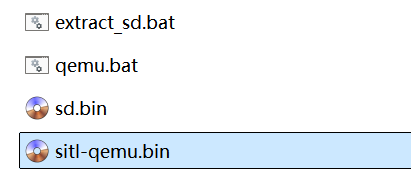

# 仿真飞行

## 基本说明

​		NextPilot支持软件在环仿真（SITL）与硬件在环仿真（HITL）。对开发者来说能够“足不出户”地快速验证新增功能，提高开发效率；对新手来说能够通过飞行培训模拟快速上手，加快学习进度；对作业人员来说能够预先进行外场飞行演练，大大降低事故风险。

## 软件在环仿真（SITL）

### 简介

​		软件在环仿真是指在计算机创建一个软件仿真环境，通过创建一个六自由度模型仿真真实飞机，所有的传感器都是虚拟的。

> 注意：软件在环仿真只支持UDP通信连接。

### 仿真环境配置

- 操作系统：Windows；
- 软件：Qemu，地面站。

**安装Qemu**

1. 下载[QEMU for Windows – Installers (64 bit)](https://qemu.weilnetz.de/w64/)，推荐7.1.0；
2. 双击安装程序，默认安装在C盘即可；

3. 安装完毕后，将qemu安装目录`C:\Program Files\qemu`添加至环境变量。

**下载仿真固件**

1. 在[飞控固件发布](https://e.gitee.com/nextpilot/repos/nextpilot/nextpilot-user-assets/sources)下载编译好的固件及相关脚本；
2. 将固件拷贝至本地文件夹下，最好拷贝至无中文路径下，整个文件夹资源如下：



**启动仿真**

1. 双击qemu.bat，自动弹出qemu终端窗口，并打印如下内容：

```bash
=================================================================
         _   __             __   ____   _  __        __
        / | / /___   _  __ / /_ / __ \ (_)/ /____   / /_
       /  |/ // _ \ | |/_// __// /_/ // // // __ \ / __/
      / /|  //  __/_>  < / /_ / ____// // // /_/ // /_
     /_/ |_/ \___//_/|_| \__//_/    /_//_/ \____/ \__/

 Copyright All Reserved (C) 2015-2026 CetcsPilot Development Team
=================================================================
HW ARCH: SITL-QEMU-A9(ver 0, rev 0)
MCU  IDC: ARM Cortex-A9(devid 0, revid 0)
MCU  UID: 000
FW  TAG: v0.9.6-4-gfa9a96911-dirty
FW HASH: fa9a969112548193815556f9f2f5b482b2cc4b35(main)
OS  VER: RT-Thread V4.1.1
OS HASH: aab2428d4177a02cd3b0fd020e47a88de379a6ab(lts-v4.1x)
Toolchain: GNU GCC 10.3.1 20210824 (release)
Build  URI: alex@2.0.0.1(alex-xiaomi)
Build TIME: Jul  3 2024 16:00:04
--------------------------------------------------------------
[39] I/sal.skt: Socket Abstraction Layer initialize success.
[66] I/SDIO: SD card capacity 262144 KB.
rt_hw_us_delay() doesn't support for this board.Please consider implementing rt_hw_us_delay() in another file.
rt_hw_us_delay() doesn't support for this board.Please consider implementing rt_hw_us_delay() in another file.
rt_hw_us_delay() doesn't support for this board.Please consider implementing rt_hw_us_delay() in another file.
msh />[1040] I/SDMNT: mount sd0 done!
[1051] I/param: start ok
[1051] I/airframe: init ok
[1056] I/dataman: start ok
[1056] I/logger_task: init ok
```

2. 启动地面站软件，会自动创建与仿真飞控的通信连接。


## 硬件在环仿真（HITL）

### 简介

​		与软件在环仿真不同，硬件在环仿真仍然运行在真实飞控硬件上，故可以连接真实的硬件外设，例如接收机，可以正常驱动如电机、舵机等执行器或其他硬件工作。

​		烧录硬件在环仿真固件，按照真机通信连接和操作方式即可进行仿真飞行。

