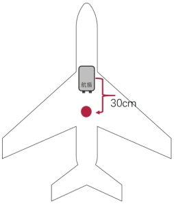

# 设备安装与连接

## 坐标系定义

机体坐标系定义：以无人机重心为原点，机头前方为X轴，机身右侧为Y轴，下方为Z轴。如下图所示：

​ 飞控坐标系定义：以飞控中心为原点，以连接器所在位置为后，飞控前侧为X轴，右侧为Y轴，下方为Z轴。飞控外壳印有坐标轴，如下图所示：

## 飞控安装

​  在安装条件允许情况下，应将飞控安装至无人机重心位置，使飞控坐标系与无人机坐标系重合。

​  若无法安装在无人机重心，则需要设置飞控在机体平台上的安装位置偏移量。安装位置定义：飞控原点在机体坐标系下的坐标。对应参数为：EKF2_IMU_POS_X，EKF2_IMU_POS_Y，EKF2_IMU_POS_Z。

​  如果坐标系无法重合，需根据实际安装条件对应调整飞控安装角度，安装角度定义：以机体坐标系为参考，飞控坐标系相对于机体坐标系的旋转角度，对应参数为SENS_BOARD_ROT。

​  对于几种典型安装，对应的旋转角度、安装位置配置如下表所示：

| 安装示例                            | 旋转角度                    | 安装位置                                                     |
| ----------------------------------- | --------------------------- | ------------------------------------------------------------ |
|  | 无旋转ROTATION_NONE         | EKF2_IMU_POS_X=0.3 EKF2_IMU_POS_Y=0 EKF2_IMU_POS_Z=0 |
|  | 顺时针转90°ROTATION_YAW_90  | EKF2_IMU_POS_X=0 EKF2_IMU_POS_Y=0.3 EKF2_IMU_POS_Z=0 |
|  | 逆时针转90°ROTATION_YAW_270 | EKF2_IMU_POS_X=0.2 EKF2_IMU_POS_Y=-0.3 EKF2_IMU_POS_Z=0 |

## 卫星天线安装

​  默认卫星主天线在后，副天线在前，由主天线到副天线的方向是与机头方向一致，若不一致，则需要设置旋转角度。旋转角度定义：主天线到副天线连成向量与机体坐标系X轴夹角（目前默认仅支持在水平面进行旋转），顺时针旋转为正。对应参数为GPS_YAW_OFFSET。

​  默认卫星主天线安装在无人机重心，若不在重心，则需要设置主天线位置，对应参数为：EKF2_GPS_POS_X，EKF2_GPS_POS_Y，EKF2_GPS_POS_Z。安装位置定义：主天线所在机体坐标系下的坐标。

​  对于几种典型安装，对应的旋转角度、安装位置配置如下表所示：

| 安装示例              | 旋转角度           | 安装位置                                                     |
| --------------------- | ------------------ | ------------------------------------------------------------ |
|  | GPS_YAW_OFFSET=0   | EKF2_GPS_POS_X=-0.3 EKF2_GPS_POS_Y=0.0 EKF2_GPS_POS_Z=0.0 |
|  | GPS_YAW_OFFSET=270 | EKF2_GPS_POS_X=0.0 EKF2_GPS_POS_Y=0.3 EKF2_GPS_POS_Z=0.0 |
|  | GPS_YAW_OFFSET=90  | EKF2_GPS_POS_X=0.0 EKF2_GPS_POS_Y=-0.3 EKF2_GPS_POS_Z=0.0 |

## 机架说明

​  无人机执行器一般包括舵机、电调电机、发动机等，驱动信号一般为PWM。飞控提供了共计32路PWM输出通道，根据不同机型，需要对应连接。

​  关于不同机型具体对应的机架在[机架设置](./04-基本设置与状态查看.md#机架设置)章节。

### 四旋翼X型机架

| 机架描述                             | 参数                 | 引脚定义                                                     |
| ------------------------------------ | -------------------- | ------------------------------------------------------------ |
| 四旋翼X型机架                        | SYS_AUTOSTART=137001 | FCS_CH1：右前电机； FCS_CH2：左后电机； FCS_CH3：左前电机； FCS_CH4：右后电机；  |
|  |                      | 电机旋转方向如左图所示。 右前电机：逆时针； 左后电机：逆时针； 左前电机：顺时针； 右后电机：顺时针；  |

### 六旋翼X型机架

| 机架描述                                                     | 参数                 | 引脚定义                                                     |
| ------------------------------------------------------------ | -------------------- | ------------------------------------------------------------ |
| 六旋翼X型机架                                                | SYS_AUTOSTART=137010 | FCS_CH1：右前电机/电机5； FCS_CH2：右中电机/电机1； FCS_CH3：右后电机/电机4； FCS_CH4：左后电机/电机6； FCS_CH5：左中电机/电机2； FCS_CH6：左前电机/电机3；  |
|  |                      | 电机旋转方向如左图所示。                                |

### 电动VTOL标准机架

| 机架描述                                             | 参数                 | 引脚定义                                                     |
| ---------------------------------------------------- | -------------------- | ------------------------------------------------------------ |
| 电动VTOL标准机架 含左右副翼、水平尾翼和垂直尾翼 | SYS_AUTOSTART=138001 | FCS_CH1：右前电机； FCS_CH2：左后电机； FCS_CH3：左前电机； FCS_CH4：右后电机； FCS_CH5：前拉/尾推电机； FCS_CH9：左副翼舵机； FCS_CH10：右副翼舵机； FCS_CH11：升降舵机； FCS_CH12：方向舵机；  |
|                   |                      |                                                              |

### 油动VTOL-倒V尾

| 机架描述                                         | 参数                 | 引脚定义                                                     |
| ------------------------------------------------ | -------------------- | ------------------------------------------------------------ |
| 油动VTOL-倒V尾 含左右副翼、左V尾翼和右V尾翼 | SYS_AUTOSTART=139002 | FCS_CH1：右前电机； FCS_CH2：左后电机； FCS_CH3：左前电机； FCS_CH4：右后电机； FCS_CH9：左副翼舵机； FCS_CH10：右副翼舵机； FCS_CH11：左V尾舵机； FCS_CH12：右V尾舵机；  |
|                                                  |                      | 电机旋转方向为： 右前电机：逆时针； 左后电机：逆时针； 左前电机：顺时针； 右后电机：顺时针；  |
