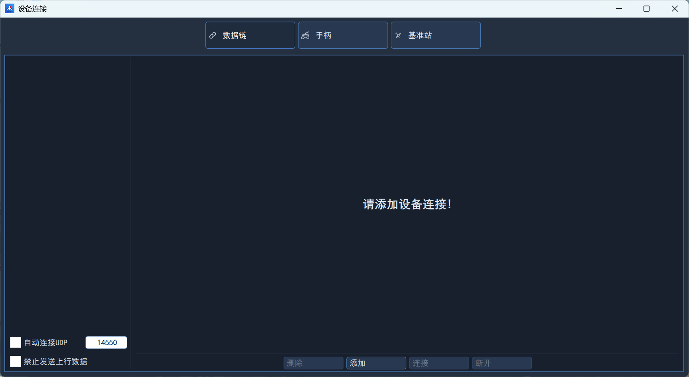
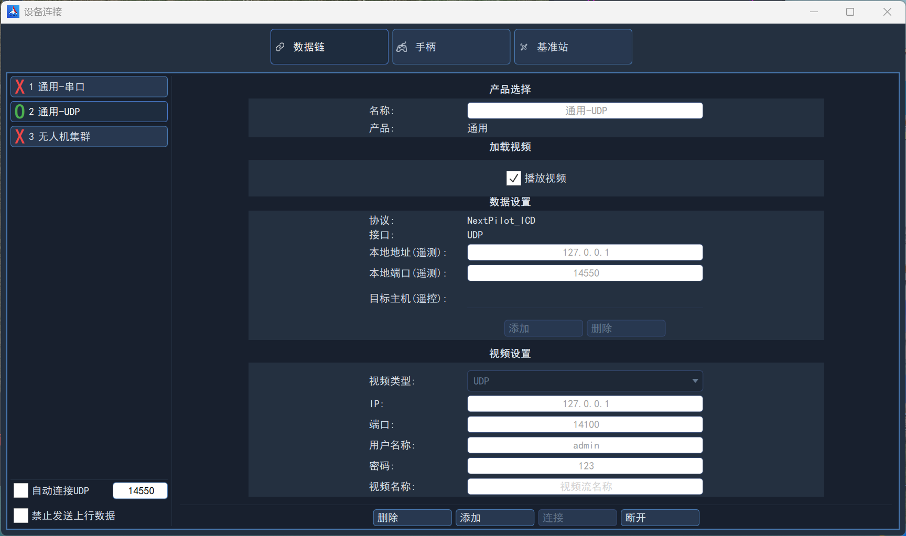
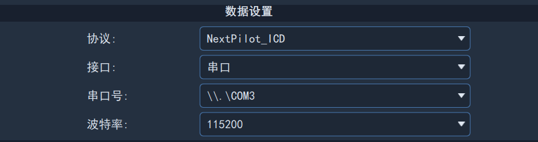
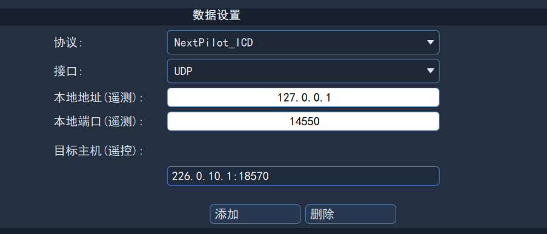
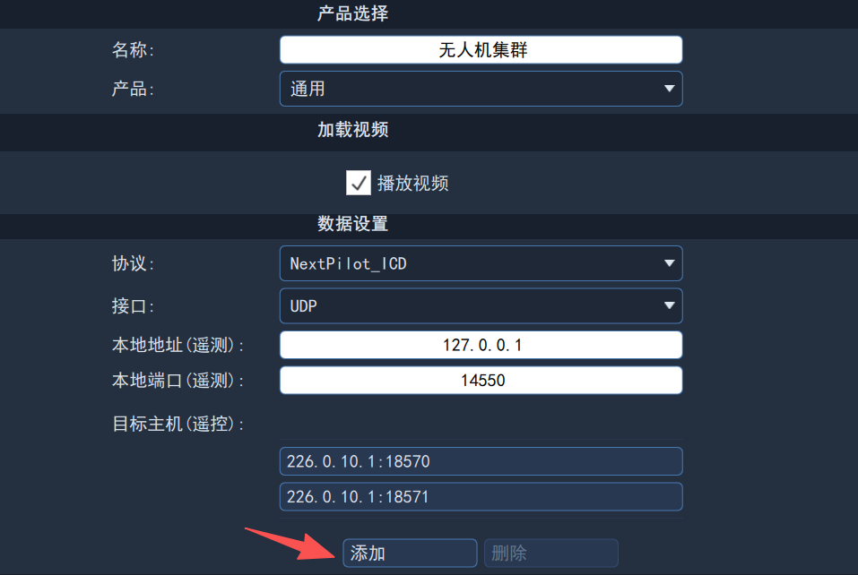

# 地面站连接

## 准备数据链

​		可选择市面上常见的数传、图传（带网口或串口）即可。

## 通信连接

​		地面站软件支持自动连接以及配置串口、网络等连接。

- 勾选左下角`自动连接`即可监听本地UDP指定端口，一旦监听到该端口有无人机通信数据即可自动创建通信连接；
- 通过点击“添加”按钮，创建串口、UDP、TCP等新的通信连接，输入名称、选择协议、选择接口，根据接口类型输入连接配置即可。

设备连接界面如下图所示：

​		所有已创建的通信连接在界面左侧显示。

## 接口类型说明

### 串口连接

​		串口连接一般在调试时使用较多，插入串口转USB至计算机后，即可选择串口设备，并且设置波特率。

### UDP连接

​		UDP连接是实际产品中应用最广泛的连接接口，一般只需要设置本地地址和本地端口即可，地面站会自动创建本地网络服务器，等待接收任何发往本地端口的数据并创建连接。如下图所示：

如果需要连接的指定无人机，则一般需要设置组播地址、本地端口、目的端口。如下图所示：

## 开启连接

​		在已创建的通信连接列表中，点击并选择，然后点击“连接”按钮即可打开通信连接。

​		如果需要连接多架无人机，可以依次选择并打开多个通信连接，地面站会根据无人机ID创建多个实例并显示在主界面。

## 自动连接

​		通过勾选“自动连接”并设置监听端口，可以在地面站软件打开后默认创建UDP连接，一般用于软件在环仿真。