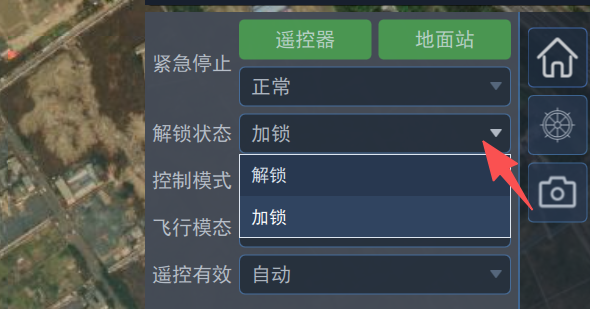
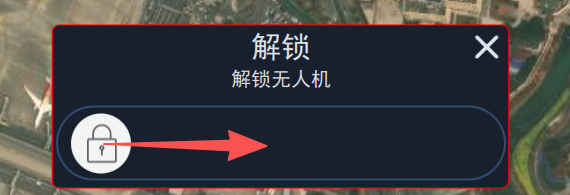
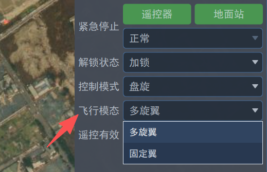

# 基础飞行介绍

## 动力恢复/切断

​  这里动力恢复/切断功能可理解为动力开车/关车，当动力切断后，各驱动器输出中断，切断动作不需要判定条件，立即有效，故也可以用于应急时的受控坠机。

​  默认将动力恢复/切断功能映射至通道7，并且在遥控器上将通道7绑定至一个旋钮开关，即可通过旋钮控制动力恢复/切断。

## 加锁解锁

​  为了保证安全，无人机需要解锁后才能实现动力输出，在上锁状态下，多旋翼动力、舵面、发动机都处于锁住状态。

​  无人机默认上电进行加锁，可通过遥控器或地面站进行解锁操作。

- 通过遥控器解锁：操作遥控器拨杆内八字实现解锁；

- 通过地面站解锁：在“解锁状态”下拉列表中选择解锁，如下图所示：

​  然后拉动滑块完成解锁操作确认，如下图所示：

## 飞行模态介绍

​  无人机包括两种飞行模态：多旋翼模态、固定翼模态。两种模态的切换有如下几种方式：

- 通过遥控器切换：通过遥控器8通道实现模态切换，一般在地面做检查时使用，切换至固定翼检查舵面是否正常，切换至多旋翼检查电机是否正常；

- 通过地面站切换：通过地面站“旋翼状态”下拉列表选择飞行模态，如下图所示：

- 自动切换：通过规划任务实现模态切换，例如加入“VTOL垂直起飞”航点实现多旋翼到固定翼切换；

- 外部控制切换：通过外部输入模态切换指令实现，注意这种切换模式需要搭配外部计算机使用。

## 飞行模式介绍

### 分类

​  无人机支持手动、自动两大类飞行模式。在手动模式下，通过操作遥控设备（如遥控器）给定飞行期望指令，在自动模式下由导航飞控自动生成期望指令。

### 手动模式

​  手动模式又包括增稳模式、定高模式、定点模式，根据飞行模态不同，每个模式下遥控器操作杆对应的控制量不一样。

在多旋翼飞行模态下，操纵杆控制量描述如下表：

| 模式 | 横滚杆   | 俯仰杆   | 油门杆       | 航向杆     | 归中响应               |
| ---- | -------- | -------- | ------------ | ---------- | ---------------------- |
| 增稳 | 横滚角度 | 俯仰角度 | 油门         | 航向角速率 | 保持姿态角水平         |
| 定高 | 横滚角度 | 俯仰角度 | 垂直方向速度 | 航向角速率 | 保持当前保持高度       |
| 定点 | 左右速度 | 前后速度 | 垂直方向速度 | 航向角速率 | 保持当前位置、航向不动 |

​  在固定翼飞行模态下，操纵杆控制量描述如下表。

| 模式 | 横滚杆   | 俯仰杆   | 油门杆 | 航向杆     | 归中响应                     |
| ---- | -------- | -------- | ------ | ---------- | ---------------------------- |
| 增稳 | 横滚角度 | 俯仰角度 | 油门   | 航向角速率 | 保持姿态水平                 |
| 定高 | 横滚角度 | 俯仰角度 | 空速   | 航向角速率 | 保持当前偏航角飞行，保持高度 |
| 定点 | 横滚角度 | 俯仰角度 | 空速   | 航向角速率 | 保持运动轨迹为直线，保持高度 |

​  可以通过遥控器5通道实现以上几种手动模式的切换，也可以通过地面站右侧控制面板发送相应模式设置命令。

### 自动模式

​  自动模式包括如下几种：

- 悬停模式：若处于多旋翼模态，则无人机在当前位置定点悬停，若处于固定翼模态，则无人机执行绕圆盘旋；

- 任务模式：无人机沿航线飞行并在航点位置做指定动作，需要由地面站规划航线并上传至无人机，否则无法进入该模式；

- 返航模式：无人机根据返航设置进行返航，例如返航至起飞点、返航至备降点、动平台返航等；

- 环绕模式：可设置环绕点、环绕方向，无人机绕该点完成飞行。

​  可以通过地面站右侧控制面板发送相应模式设置命令。

## 飞前检查

​  在进行全流程飞行之前，需要进行飞前检查，保证飞行安全。在地面站点击“飞前检查”按钮，进入操作界面，飞前检查主要内容有：

1. 电源管理检查；

2. 组合导航检查；

3. 手柄输入检查；

4. 无线遥控检查；

5. 控制输出检查；

6. 动力引擎检查；

7. 航线任务检查。
