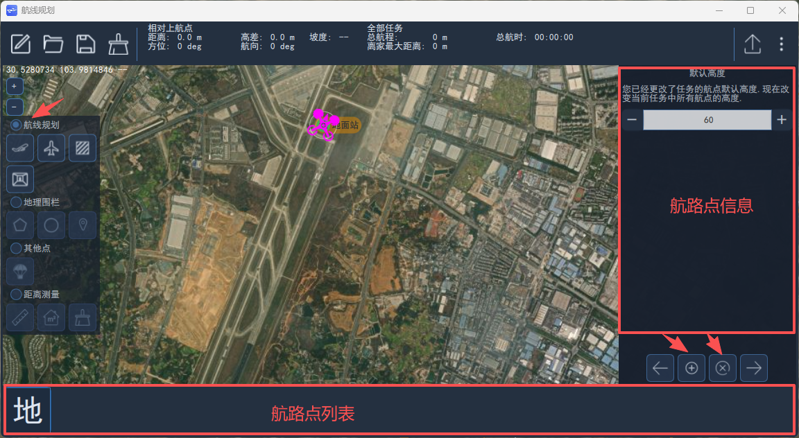
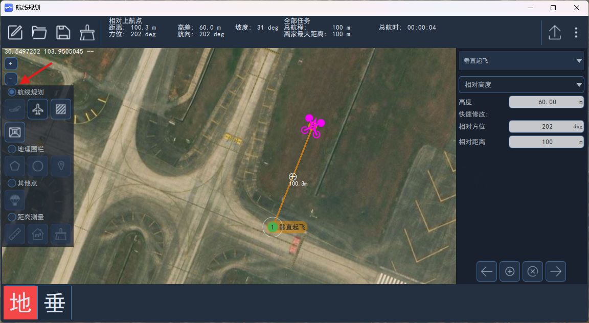
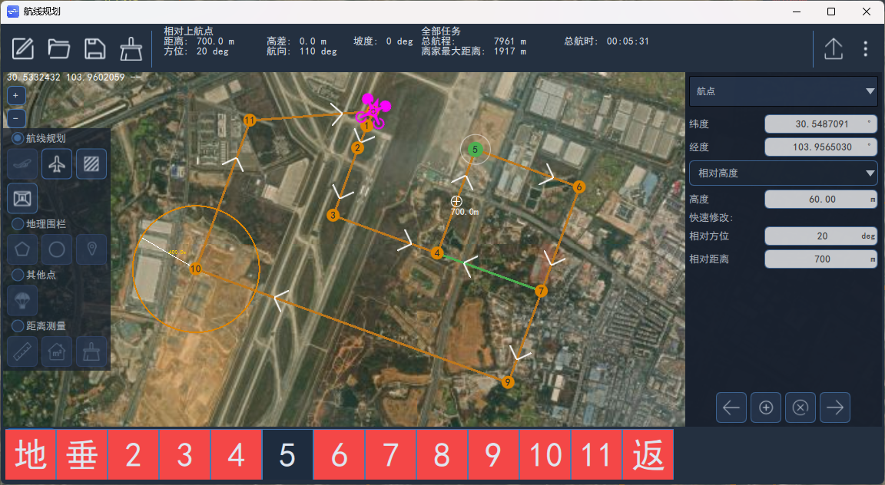
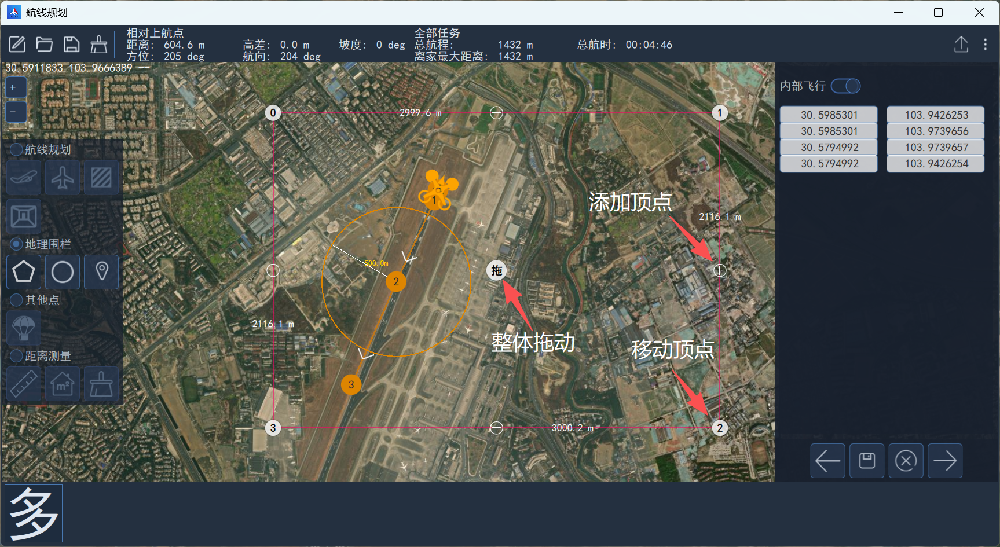

# 航线规划

​  航线规划界面包括上方为工具栏、状态栏，左侧为规划功能选择，右侧显示航路点信息，下方为规划航路点列表。

## 飞行航线绘制

### 添加垂直起飞航点

​  对于垂起构型的无人机，进行自主任务飞行时，航线的第一个航点必须是VTOL垂直起飞航点。

​  绘制航线时，先点击左侧航线规划下的“起飞”图标，然后在无人机出航方向的附近位置左击，添加VTOL垂直起飞航点。

### 添加航点

​  然后再选择航点，在地图上左击即可添加航点。

### 更改航点类型

​  目前支持航点类型共计十余种，若需要更改航点类型，可选择航点后，在右侧航点类型下拉列表中选择。如下图所示：

​  具体航点类型说明请参考[常用航点类型](#常用航点类型)。

### 修改航点属性

​  根据航点类型不同，其属性也不同，可选择航点后，在右侧查看或修改属性，也可以通过**快速修改**的**相对方位角**和**相对距离**设置下一点的位置。

## 常用航点类型

### 垂直起飞航点（VTOL takeoff）

​  垂起固定翼无人机执行任务（Mission）模式飞行时，需选择该航点作为第一个航路点，否则将导致无人机无法自动切换到固定翼飞行模态。设置该点后，垂起固定翼无人机以多旋翼飞行模态垂直起飞，到达指定高度后，无人机自动旋转航向对准该点，然后起动尾推/前拉动力，开始多旋翼转换固定翼。

### 普通（Waypoint）航点

​  普通航点控制无人机的水平位置和高度，当水平位置和高度均到达设定值时判定无人机到达该航点，当无人机固定翼模态飞行水平位置到达、高度未到达时，无人机以盘旋方式控制无人机高度到达设定值。

### 返航（Return To Launch）航点

​  返航航点为指令航点（指令航点不控制无人机位置和高度，相当于无人机在飞行过程中自动发送的控制指令）。当无人机到达返航航点的上一航点时，自动切换为返航模式。

### 垂起着陆（VTOL transition and land）/着陆（land）航点

​  对于垂起固定翼无人机垂起着陆航点和着陆航点控制逻辑相同，当目标点是该航点时，无人机到航点的距离小于后向转换距离时开始进行多旋翼切换。

### 盘旋（Loiter）航点

​  该航点为无限盘旋点，可设置盘旋高度、盘旋半径、盘旋方向（即顺时针或逆时针盘旋）。当无人机到盘旋点距离大于盘旋半径与转弯提前量（NAV_ACC_RAD）之和时，无人机从当前位置直线飞向盘旋点，无人机高度指令为设定的盘旋高度；当无人机高度到达盘旋点设定的高度且水平距离小于盘旋半径与转弯提前量之和时，开始进行盘旋控制。

### 盘旋（时间）[Loiter(time)]航点

​  按时间进行盘旋航点，当到达盘旋时间时无人机退出盘旋继续进行任务飞行。该航点可设定盘旋高度、盘旋时间和盘旋半径，当盘旋设定值大于0时为顺时针盘旋，小于0为逆时针盘旋。

​  当无人机距盘旋点距离大于盘旋半径与转弯提前量之和时，无人机从当前位置直线飞向盘旋点，无人机高度指令为设定的盘旋高度；当无人机高度到达航点设定的高度且水平距离小于盘旋半径与转弯提前量之和时，开始进行盘旋控制。

​  退出盘旋时可设置等待航向与切点退出，如下图所示。当设定按航向退出时，盘旋时间到达后无人机航向对准下一待飞航点时，无人机退出盘旋；当设定切线退出时，无人机先飞行到切点，在飞行下一待飞航点。若不设定等待航向退出和切线退出，则无人机盘旋到设定时间后之间飞向下一待飞航点。

### 盘旋（高度）[Loiter(altitude)]航点

​  盘旋到指定的高度，当到达盘旋高度时无人机退出盘旋继续进行任务飞行。可设置盘旋高度和盘旋半径：当盘旋设定值大于0时为顺时针盘旋，小于0为逆时针盘旋。

​  当无人机距盘旋点距离大于盘旋半径与转弯提前量之和时，无人机从当前位置以当前高度按航线飞向盘旋点；当无人机与盘旋（高度）航点水平距离小于盘旋半径与转弯提前量之和时，开始进行盘旋控制。

​  退出盘旋时可选择等待航向与切点退出。

### 跳转（Jump to item）航点

​  跳转为指令航点，可设置跳转的航点号和跳转次数。当无人机到达该航点的上一航点时，目标航点自动设置为设定的跳转的航点号；当到达跳转次数时，则不进行跳转。

### 速度（Change speed）航点

​  速度航点为指令航点，更改无人机飞行速度，可设置无人机的飞行速度或油门。当无人机到达该航点的上一航点时，根据设定飞行速度或油门值进行飞行。

### 着陆起始（Land start）航点

​  着陆起始航点为指令航点，不需要设置参数。当返航方式RTL_TYPE设置为1时且航线中有垂起着陆航点或着陆航点时，返航过程中无人机首先直线飞向着陆起始航点的下一航点，然后根据航线进行返航，相对于设定的返航航线。

## 地理围栏设置

​  在航线规划界面，勾选“地理围栏”后，可以在地图上绘制多边形以及圆形围栏区域。

​  点击“多边形”图标，然后左键点击任意位置即可绘制多边形围栏，默认创建一个四边形，通过按住左键拖动白色原点即可实现整体位置拖动、顶点位置移动操作，点击某条边上的“+”号，可添加新的顶点。每个顶点的经纬度坐标在右侧显示，并且支持编辑。

​  点击“圆形”图标，然后左键点击任意位置即可绘制圆形围栏，通过按住左键拖动白色原点即可实现位置拖动和调整大小。中心点的坐标、半径在右侧显示，并且支持编辑。

