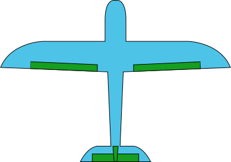
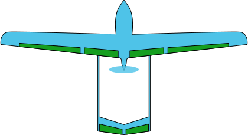

# 机架说明

无人机执行器一般包括舵机、电调电机、发动机等，驱动信号一般为PWM。飞控提供了共计16路PWM输出通道，根据不同机型，需要对应连接。

关于不同机型具体对应的机架在[机架设置](../02-飞控设置/01-基础设置.md#机架设置)章节。

下列各表中，机架引脚定义对应的线序请参考[飞控接口](../../product/01-飞行控制计算机/01-NP-FCC-H50.md#接口定义)。

## 四旋翼X型机架

| 机架描述                             | 参数                                              | 引脚定义                                                     |
| ------------------------------------ | ------------------------------------------------- | ------------------------------------------------------------ |
|  | SYS_AUTOSTART=137001 四旋翼X型机架（左前顺） | FCS_CH1：右前电机（逆时针）； FCS_CH2：左后电机（逆时针）； FCS_CH3：左前电机（顺时针）； FCS_CH4：右后电机（顺时针）；  |
|                                      | SYS_AUTOSTART=137002 四旋翼X型机架（左前逆） | FCS_CH1：右前电机（顺时针）； FCS_CH2：左后电机（顺时针）； FCS_CH3：左前电机（逆时针）； FCS_CH4：右后电机（逆时针）；  |

## 六旋翼X型机架

| 机架描述                             | 参数                                              | 引脚定义                                                     |
| ------------------------------------ | ------------------------------------------------- | ------------------------------------------------------------ |
|  | SYS_AUTOSTART=137010 六旋翼X型机架（左前顺） | FCS_CH1：右前电机/电机5（逆时针）； FCS_CH2：右中电机/电机1（顺时针）； FCS_CH3：右后电机/电机4（逆时针）； FCS_CH4：左后电机/电机6（顺时针）； FCS_CH5：左中电机/电机2（逆时针）； FCS_CH6：左前电机/电机3（顺时针）；  |
|                                      | SYS_AUTOSTART=137011 六旋翼X型机架（左前逆） | FCS_CH1：右前电机/电机5（顺时针）； FCS_CH2：右中电机/电机1（逆时针）； FCS_CH3：右后电机/电机4（顺时针）； FCS_CH4：左后电机/电机6（逆时针）； FCS_CH5：左中电机/电机2（顺时针）； FCS_CH6：左前电机/电机3（逆时针）；  |

## 电动VTOL

| 机架描述                            | 参数                                                         | 引脚定义                                                     |
| ----------------------------------- | ------------------------------------------------------------ | ------------------------------------------------------------ |
|  | SYS_AUTOSTART=138001 电动VTOL标准机架 含左右副翼、水平尾翼和垂直尾翼 | FCS_CH1：右前电机（逆时针）； FCS_CH2：左后电机（逆时针）； FCS_CH3：左前电机（顺时针）； FCS_CH4：右后电机（顺时针）； FCS_CH5：前拉/尾推电机； FCS_CH9：左副翼舵机； FCS_CH10：右副翼舵机； FCS_CH11：升降舵机； FCS_CH12：方向舵机；  |
|                                     | SYS_AUTOSTART=138002 电动VTOL-A尾 含左右副翼、左V尾翼和右V尾翼 | FCS_CH1：右前电机（逆时针）； FCS_CH2：左后电机（逆时针）； FCS_CH3：左前电机（顺时针）； FCS_CH4：右后电机（顺时针）； FCS_CH5：前拉/尾推电机； FCS_CH9：左副翼舵机； FCS_CH10：右副翼舵机； FCS_CH11：左倒V尾舵机； FCS_CH12：右倒V尾舵机；  |
|                                     | SYS_AUTOSTART=138003 电动VTOL-V尾 含左右副翼、左V尾翼和右V尾翼 | FCS_CH1：右前电机（逆时针）； FCS_CH2：左后电机（逆时针）； FCS_CH3：左前电机（顺时针）； FCS_CH4：右后电机（顺时针）； FCS_CH5：前拉/尾推电机； FCS_CH9：左副翼舵机； FCS_CH10：右副翼舵机； FCS_CH11：左V尾舵机； FCS_CH12：右V尾舵机；  |

## 油动VTOL

| 机架描述 | 参数                                                         | 引脚定义                                                     |
| -------- | ------------------------------------------------------------ | ------------------------------------------------------------ |
|          | SYS_AUTOSTART=140001 油动VTOL-A尾（左前逆） 含左右副翼、左V尾翼和右V尾翼 | FCS_CH1：右前电机（顺时针）； FCS_CH2：左后电机（顺时针）； FCS_CH3：左前电机（逆时针）； FCS_CH4：右后电机（逆时针）； FCS_CH9：左副翼舵机； FCS_CH10：右副翼舵机； FCS_CH11：左倒V尾舵机； FCS_CH12：右倒V尾舵机； FCS_CH16：发动机油门；  |
|          | SYS_AUTOSTART=140002 油动VTOL-A尾（左前顺） 含左右副翼、左V尾翼和右V尾翼 | FCS_CH1：右前电机（逆时针）； FCS_CH2：左后电机（逆时针）； FCS_CH3：左前电机（顺时针）； FCS_CH4：右后电机（顺时针）； FCS_CH9：左副翼舵机； FCS_CH10：右副翼舵机； FCS_CH11：左倒V尾舵机； FCS_CH12：右倒V尾舵机； FCS_CH16：发动机油门；  |

## 固定翼

| 机架描述                             | 参数                                                         | 引脚定义                                                     |
| ------------------------------------ | ------------------------------------------------------------ | ------------------------------------------------------------ |
|       | SYS_AUTOSTART=2100 固定翼标准机架 含左右副翼、水平尾翼和垂直尾翼 | FCS_CH5：前拉/尾推电机； FCS_CH9：左副翼舵机； FCS_CH10：右副翼舵机； FCS_CH11：左倒V尾舵机； FCS_CH12：右倒V尾舵机；  |
|  | SYS_AUTOSTART=2106 固定翼A尾 含左右副翼、左V尾翼和右V尾翼 | FCS_CH5：前拉/尾推电机； FCS_CH9：左副翼舵机； FCS_CH10：右副翼舵机； FCS_CH11：左倒V尾舵机； FCS_CH12：右倒V尾舵机；  |
|                                      | SYS_AUTOSTART=2107 固定翼V尾 含左右副翼、左V尾翼和右V尾翼 | FCS_CH5：前拉/尾推电机； FCS_CH9：左副翼舵机； FCS_CH10：右副翼舵机； FCS_CH11：左V尾舵机； FCS_CH12：右V尾舵机；  |

