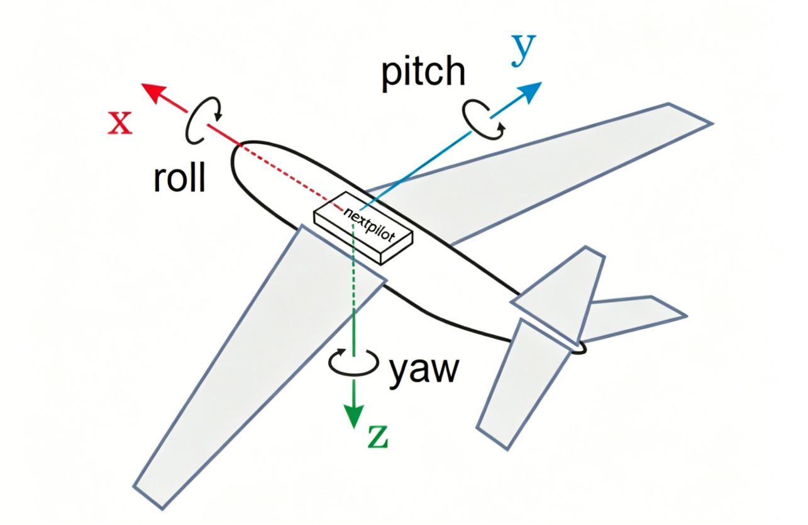
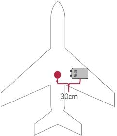
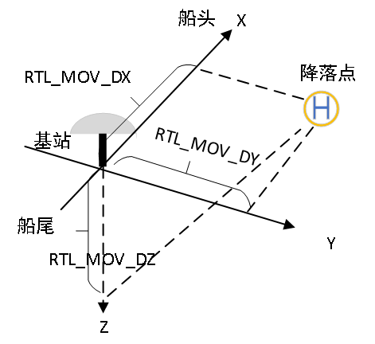

# 设备安装

## 坐标系定义

机体坐标系定义：以无人机重心为原点，机头前方为X轴，机身右侧为Y轴，下方为Z轴。如下图所示：

{alt="image-20260615110910637" style="zoom:40%; display:block; margin:0 auto;"}

飞控坐标系定义：以飞控中心为原点，以连接器所在位置为后，飞控前侧为X轴，右侧为Y轴，下方为Z轴。飞控外壳印有坐标轴，如下图所示：

## 飞行控制计算机

在安装条件允许情况下，应将飞控安装至无人机重心位置，使飞控坐标系与无人机坐标系重合。

若无法安装在无人机重心，则需要设置飞控在机体平台上的安装位置偏移量。安装位置定义：飞控原点在机体坐标系下的坐标。对应参数为：EKF2_IMU_POS_X，EKF2_IMU_POS_Y，EKF2_IMU_POS_Z。

如果坐标系无法重合，需根据实际安装条件对应调整飞控安装角度，安装角度定义：以机体坐标系为参考，飞控坐标系相对于机体坐标系的旋转角度，对应参数为SENS_BOARD_ROT。

对于几种典型安装，对应的旋转角度、安装位置配置如下表所示：

| 安装示例                            | 旋转角度                    | 安装位置                                                     |
| ----------------------------------- | --------------------------- | ------------------------------------------------------------ |
|  | 无旋转ROTATION_NONE         | EKF2_IMU_POS_X=0.3 EKF2_IMU_POS_Y=0 EKF2_IMU_POS_Z=0 |
|  | 顺时针转90°ROTATION_YAW_90  | EKF2_IMU_POS_X=0 EKF2_IMU_POS_Y=0.3 EKF2_IMU_POS_Z=0 |
|  | 逆时针转90°ROTATION_YAW_270 | EKF2_IMU_POS_X=0.2 EKF2_IMU_POS_Y=-0.3 EKF2_IMU_POS_Z=0 |

## 机载卫导天线

默认卫星主天线在后，副天线在前，由主天线到副天线的方向是与机头方向一致，若不一致，则需要设置旋转角度。旋转角度定义：主天线到副天线连成向量与机体坐标系X轴夹角（目前默认仅支持在水平面进行旋转），顺时针旋转为正。对应参数为GPS_YAW_OFFSET。

> 关于飞控主副天线的连接请参考[产品说明中电气连接部分](../../product/01-飞行控制计算机/01-NP-FCC-H50.md#电气接口)。

默认卫星主天线安装在无人机重心，若不在重心，则需要设置主天线位置，对应参数为：EKF2_GPS_POS_X，EKF2_GPS_POS_Y，EKF2_GPS_POS_Z。安装位置定义：主天线所在机体坐标系下的坐标。

对于几种典型安装，对应的旋转角度、安装位置配置如下表所示：

| 安装示例              | 旋转角度           | 安装位置                                                     |
| --------------------- | ------------------ | ------------------------------------------------------------ |
|  | GPS_YAW_OFFSET=0   | EKF2_GPS_POS_X=-0.3 EKF2_GPS_POS_Y=0.0 EKF2_GPS_POS_Z=0.0 |
|  | GPS_YAW_OFFSET=270 | EKF2_GPS_POS_X=0.0 EKF2_GPS_POS_Y=0.3 EKF2_GPS_POS_Z=0.0 |
|  | GPS_YAW_OFFSET=90  | EKF2_GPS_POS_X=0.0 EKF2_GPS_POS_Y=-0.3 EKF2_GPS_POS_Z=0.0 |

## 大气数据计算机

空速计并没有特别安装位置的要求，可通过粘接或者根据螺丝孔位尺寸固定至机体即可，然后将空速计动压孔和静压孔连接皮托管，注意空速软管不能有折叠以免堵住，导致压差测量不准。

## 地面差分基准站

### 作为一般RTK基准站使用

将基准站静置放置在地面，连接主天线即可。

### 动平台起降作业中使用

针对移动平台（如车、船）起降作业，为了实现无人机降落在移动平台的指定区域，飞控需要获取如下两个信息：

- 降落点与主天线的相对位置；
- 主副天线与动平台的相对角度。

以主天线为中心，移动平台前方为X轴正方向、右方为Y轴正方形，下方为Z轴正方向，建立坐标系，那么降落点在该坐标系下的坐标就是相对于主天线的位置，对应的飞控参数为RMB_DX、RMB_DY、RMB_DZ。

从主天线到副天线连成一条直线，该直线与X轴的夹角就是相对角度，对应的飞控参数为RMB_OFFSET_HDG。

几种典型的双天线朝向与参数的对应关系为：

- 辅天线在前、主天线在后放置时：RMB_OFFSET_HDG=0；

- 辅天线在右、主天线在左放置时：RMB_OFFSET_HDG=90；
- 辅天线在左、主天线在右放置时：RMB_OFFSET_HDG=270。