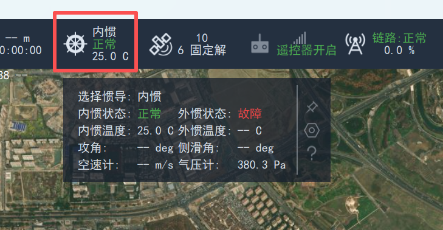
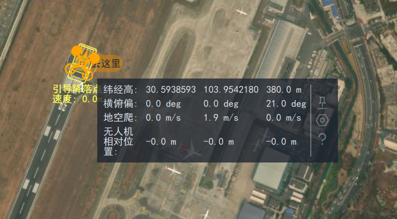
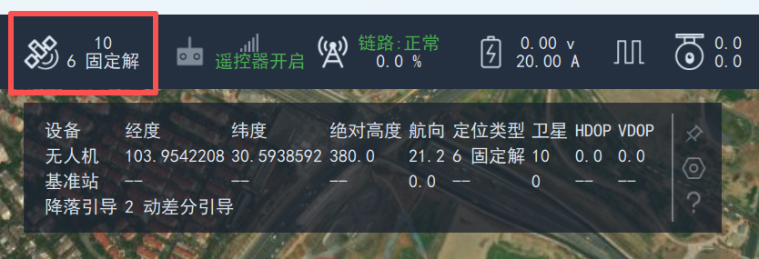
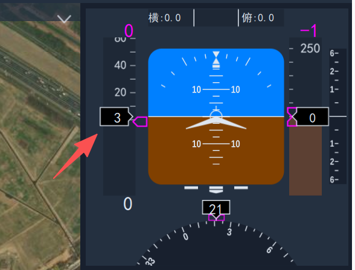
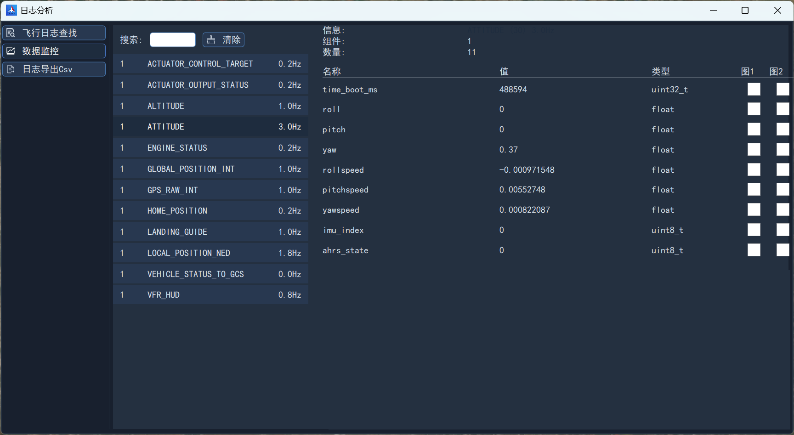

# 状态查看

安装完成后，将飞控置于空旷无遮挡环境下，获取卫星定位后，可通过地面站查看基本状态。

## 查看惯导

点击状态栏惯导图标即可显示惯导状态数据，包括当前所选惯导、工作状态、温度等信息。

## 查看位置、姿态

点击地图上无人机图标，即可显示飞行标签，包括无人机位置、姿态数据，如下图所示：

另外可以通过点击卫导图标，显示卫导状态数据，可查看当前引导状态（动平台飞行需要）、无人机经纬度、航向、定位类型、卫星数量等信息。

## 查看空速

可在飞行标签查看空速，或者在仪表盘查看空速。

## 查看电压

点击状态栏电池图标，即可查看动力电池状态数据，包括电压、剩余电量等。

## 查看消息

在左侧侧栏常规区域，点击`日志分析`，进入数据监控界面，可查看飞控下发的所有数据消息，包括消息名称、频率等。

