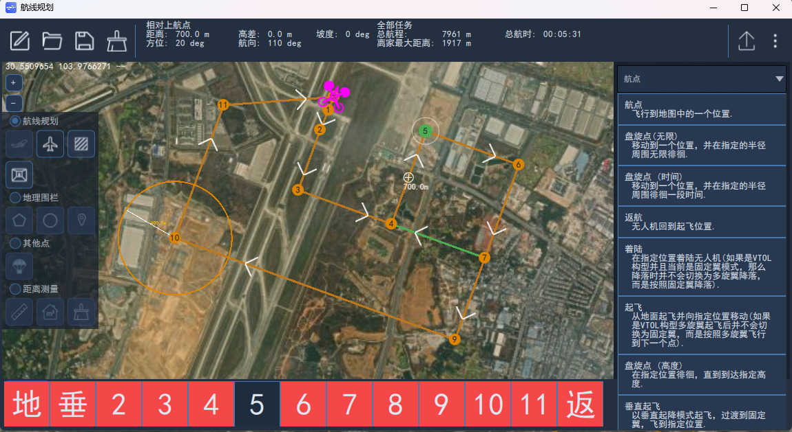
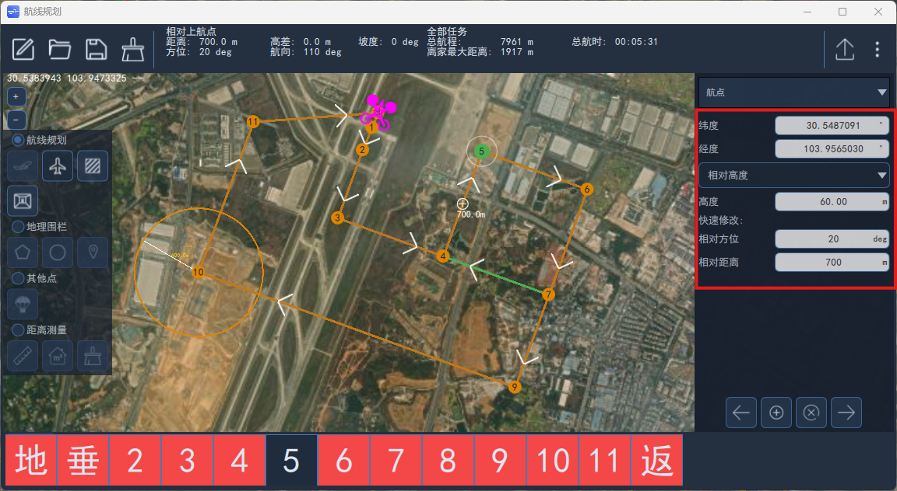
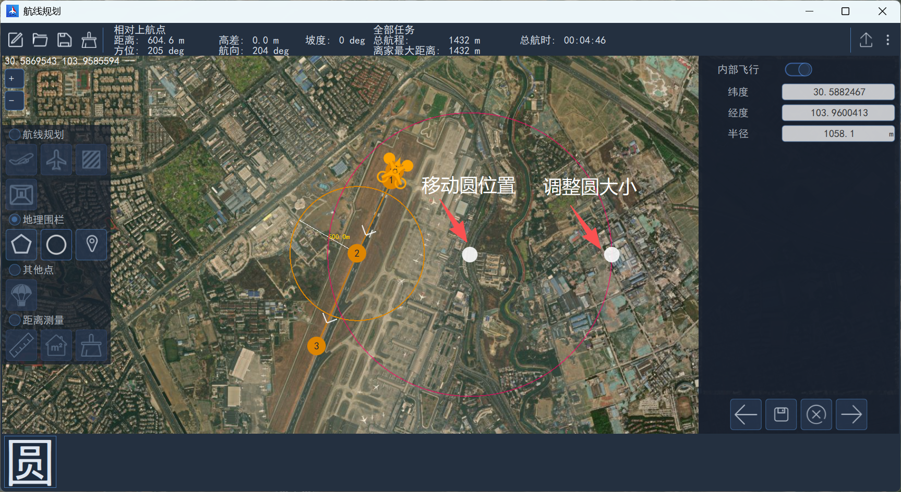
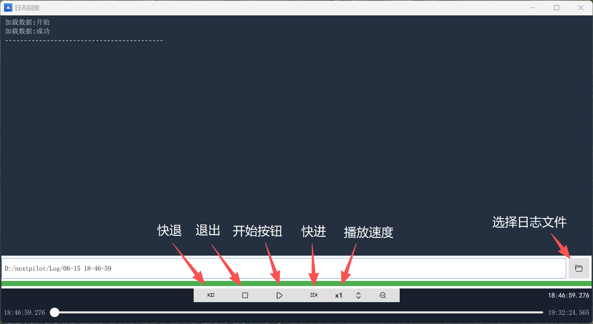
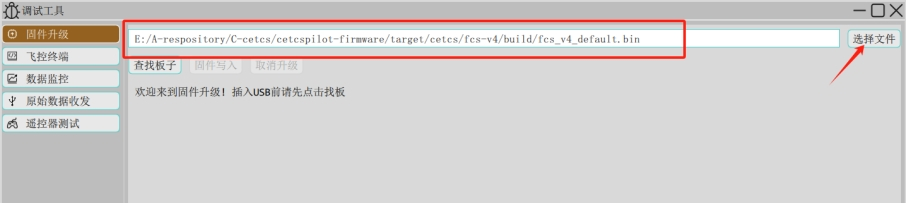

# 地面站使用说明

## 航线规划

### 界面布局

​  航线规划界面包括上方为工具栏、状态栏，左侧为规划功能选择，右侧显示航路点信息，下方为规划航路点列表。

### 绘制航线

#### 添加垂直起飞航点

​  对于垂起构型的无人机，进行自主任务飞行时，航线的第一个航点必须是VTOL垂直起飞航点。

​  绘制航线时，先点击左侧航线规划下的“起飞”图标，然后在无人机出航方向的附近位置左击，添加VTOL垂直起飞航点。

#### 添加航点

​  然后再选择航点，在地图上左击即可添加航点。

#### 更改航点类型

​  目前支持航点类型共计十余种，若需要更改航点类型，可选择航点后，在右侧航点类型下拉列表中选择。如下图所示：

​  具体航点类型说明请参考[常用航点类型](#常用航点类型)。

#### 修改航点属性

​  根据航点类型不同，其属性也不同，可选择航点后，在右侧查看或修改属性，也可以通过**快速修改**的**相对方位角**和**相对距离**设置下一点的位置。

### 常用航点类型

#### 垂直起飞航点（VTOL takeoff）

​  垂起固定翼无人机执行任务（Mission）模式飞行时，需选择该航点作为第一个航路点，否则将导致无人机无法自动切换到固定翼飞行模态。设置该点后，垂起固定翼无人机以多旋翼飞行模态垂直起飞，到达指定高度后，无人机自动旋转航向对准该点，然后起动尾推/前拉动力，开始多旋翼转换固定翼。

#### 普通（Waypoint）航点

​  普通航点控制无人机的水平位置和高度，当水平位置和高度均到达设定值时判定无人机到达该航点，当无人机固定翼模态飞行水平位置到达、高度未到达时，无人机以盘旋方式控制无人机高度到达设定值。

#### 返航（Return To Launch）航点

​  返航航点为指令航点（指令航点不控制无人机位置和高度，相当于无人机在飞行过程中自动发送的控制指令）。当无人机到达返航航点的上一航点时，自动切换为返航模式。

#### 垂起着陆（VTOL transition and land）/着陆（land）航点

​  对于垂起固定翼无人机垂起着陆航点和着陆航点控制逻辑相同，当目标点是该航点时，无人机到航点的距离小于后向转换距离时开始进行多旋翼切换。

#### 盘旋（Loiter）航点

​  该航点为无限盘旋点，可设置盘旋高度、盘旋半径、盘旋方向（即顺时针或逆时针盘旋）。当无人机到盘旋点距离大于盘旋半径与转弯提前量（NAV_ACC_RAD）之和时，无人机从当前位置直线飞向盘旋点，无人机高度指令为设定的盘旋高度；当无人机高度到达盘旋点设定的高度且水平距离小于盘旋半径与转弯提前量之和时，开始进行盘旋控制。

#### 盘旋（时间）[Loiter(time)]航点

​  按时间进行盘旋航点，当到达盘旋时间时无人机退出盘旋继续进行任务飞行。该航点可设定盘旋高度、盘旋时间和盘旋半径，当盘旋设定值大于0时为顺时针盘旋，小于0为逆时针盘旋。

​  当无人机距盘旋点距离大于盘旋半径与转弯提前量之和时，无人机从当前位置直线飞向盘旋点，无人机高度指令为设定的盘旋高度；当无人机高度到达航点设定的高度且水平距离小于盘旋半径与转弯提前量之和时，开始进行盘旋控制。

​  退出盘旋时可设置等待航向与切点退出，如下图所示。当设定按航向退出时，盘旋时间到达后无人机航向对准下一待飞航点时，无人机退出盘旋；当设定切线退出时，无人机先飞行到切点，在飞行下一待飞航点。若不设定等待航向退出和切线退出，则无人机盘旋到设定时间后之间飞向下一待飞航点。

#### 盘旋（高度）[Loiter(altitude)]航点

​  盘旋到指定的高度，当到达盘旋高度时无人机退出盘旋继续进行任务飞行。可设置盘旋高度和盘旋半径：当盘旋设定值大于0时为顺时针盘旋，小于0为逆时针盘旋。

​  当无人机距盘旋点距离大于盘旋半径与转弯提前量之和时，无人机从当前位置以当前高度按航线飞向盘旋点；当无人机与盘旋（高度）航点水平距离小于盘旋半径与转弯提前量之和时，开始进行盘旋控制。

​  退出盘旋时可选择等待航向与切点退出。

#### 跳转（Jump to item）航点

​  跳转为指令航点，可设置跳转的航点号和跳转次数。当无人机到达该航点的上一航点时，目标航点自动设置为设定的跳转的航点号；当到达跳转次数时，则不进行跳转。

#### 速度（Change speed）航点

​  速度航点为指令航点，更改无人机飞行速度，可设置无人机的飞行速度或油门。当无人机到达该航点的上一航点时，根据设定飞行速度或油门值进行飞行。

#### 着陆起始（Land start）航点

​  着陆起始航点为指令航点，不需要设置参数。当返航方式RTL_TYPE设置为1时且航线中有垂起着陆航点或着陆航点时，返航过程中无人机首先直线飞向着陆起始航点的下一航点，然后根据航线进行返航，相对于设定的返航航线。

## 地理围栏设置

​  在航线规划界面，勾选“地理围栏”后，可以在地图上绘制多边形以及圆形围栏区域。

​  点击“多边形”图标，然后左键点击任意位置即可绘制多边形围栏，默认创建一个四边形，通过按住左键拖动白色原点即可实现整体位置拖动、顶点位置移动操作，点击某条边上的“+”号，可添加新的顶点。每个顶点的经纬度坐标在右侧显示，并且支持编辑。

​  点击“圆形”图标，然后左键点击任意位置即可绘制圆形围栏，通过按住左键拖动白色原点即可实现位置拖动和调整大小。中心点的坐标、半径在右侧显示，并且支持编辑。

## 故障保护设置

​  进入飞控设置->安全保护界面可设置常见故障的保护处理逻辑。

### 低电量保护

​  低电压保护有三级保护，分别对应告警电量、紧急电量和危急电量如下表所示：

| 序号 | 等级            | 电量                             | 说明                       |
| ---- | --------------- | -------------------------------- | -------------------------- |
| 1.   | 告警(Warning)   | BAT_LOW_THR=15%（默认12%~40%）   | 提醒用户                   |
| 2.   | 紧急(Critical)  | BAT_CRIT_THR=7%（默认5%~10%）    | 表示低于该电量应该立即返航 |
| 3.   | 危急(Emergency) | BAT_EMERGEN_THR=5% （默认3%~7%） | 表示低于该电量应该立即着陆 |

​  根据COM_LOW_BAT_ACT参数设置系统保护，如下表所示：

| 序号 | COM_LOW_BAT_ACT | 措施                       | 备注   |
| ---- | --------------- | -------------------------- | ------ |
| 1.   | 0               | 告警                       | 不推荐 |
| 2.   | 1               | 返航                       |        |
| 3.   | 2               | 就地着陆                   |        |
| 4.   | 3               | 紧急则返航、危急则就地着陆 |        |

### 遥控器信号丢失保护

​  遥控器信号丢失保护只对增稳（Stab）、定高（AltCtr）、定点（PosCtr）等手控模式生效，对大部分自动任务模式失效。主要有以下参数控制：

- COM_RC_LOSS_T：设置判定丢失时间，默认0.5s；

- NAV_RCL_ACT：判定信号丢失之后执行的动作，常用的包括悬停（Hold mode）、降落（Land mode）、返航（Return Mode）。

​  各模式下对应的保护逻辑如下表所示：

| 序号 | NAV_RCL_ACT | 手控模式                           | 自动模式             | 备注 |
| ---- | ----------- | ---------------------------------- | -------------------- | ---- |
| 1.   | 悬停        | 地面站告警，无人机保持当前位置悬停 | 无响应，继续自主任务 |      |
| 2.   | 返航        | 地面站告警，无人机开始返航         | 无响应，继续自主任务 |      |
| 3.   | 降落        | 地面站告警，无人机开始降落         | 无响应，继续自主任务 |      |

### 数据链通信丢失保护

​  数据链丢失保护只对任务（MISSION）、盘旋（LOITER）、环绕（ORBIT）等自动模式生效，主要由以下两个参数设置：

- COM_DL_LOSS_T：设置判定丢失时间，默认10s。

- NAV_DLL_ACT：设置丢失之后的保护动作，包括无动作（Disabled）、悬停（Hold mode）、降落（Land mode）、返航（Return Mode）等。

​  各模式下对应的保护逻辑如下表所示：

| 序号 | NAV_DLL_ACT | 手控模式 | 自动模式                               | 备注 |
| ---- | ----------- | -------- | -------------------------------------- | ---- |
| 1.   | 无          | 无响应   | 无响应                                 |      |
| 2.   | 悬停        | 无响应   | 地面站告警，无人机在当前位置、高度悬停 |      |
| 3.   | 返航        | 无响应   | 地面站告警，无人机返航                 |      |
| 4.   | 降落        | 无响应   | 地面站告警，无人机降落                 |      |

### 导航卫星失效保护

​  卫星丢失保护逻辑触发后，可设置盘旋高度、油门、横滚角等。

​  相关参数如下表所示：

| 序号 | 参数           | 说明                                        | 建议参数                      |
| ---- | -------------- | ------------------------------------------- | ----------------------------- |
| 1.   | NAV_GPSF_ACT   | 0：盘旋与定向飞行1：一直定向飞行2：一直盘旋 | 卫星丢失后将无航向只能设置为2 |
| 2.   | NAV_GPSF_R     | 固定滚转角                                  | 15deg                         |
| 3.   | NAV_GPSF_P     | 固定俯仰角                                  | 0deg                          |
| 4.   | NAV_GPSF_TR    | 固定油门（高度和速度无效时使用）            | 30%                           |
| 5.   | NAV_GPSF_ALT   | 盘旋高度（大于10001时，使用当前高度）       | 10001                         |
| 6.   | NAV_GPSF_ARSPD | 巡航速度（设定为0，则使用设定巡航速度）     | 0m/s                          |

### 发动机失效保护

​  发动机失效保护逻辑触发后，可设置俯仰角、返航高度等。

​  相关参数如下表所示：

| 序号 | 参数          | 说明               | 建议参数 |
| ---- | ------------- | ------------------ | -------- |
| 1.   | EF_APT_PITCH  | 指令俯仰角         | -5deg    |
| 2.   | EF_ROLL_MAX   | 滚转角限幅         | 35deg    |
| 3.   | EF_MC_ACC_RAD | 多旋翼提前量       | 100m     |
| 4.   | EF_RTN_ALT    | 返航高度           | 60m      |
| 5.   | EF_TRANS_ALT  | 固定翼转多旋翼高度 | 50m      |
| 6.   | EF_LOITER_RAD | 盘旋半径           | 150m     |

### 地理围栏保护

​  无人机支持两种形式的地理围栏：

1. 圆柱形围栏，可通过最大水平距离（GF_MAX_VER_DIST）和最大垂直距离（GF_MAX_HOR_DIST）参数设置一个圆柱形；

2. 在任务规划界面，可编辑由多个坐标点组成一个圆形或者多边形区域。

​  以上两种形式可同时有效，触碰任意围栏都会响应保护逻辑。采用GF_ACTION参数设置保护逻辑触发时切换模式，当前可选包括无动作（None）、告警（Warning）、悬停（Hold mode）、降落（Land mode）、返航（Return Mode），参数值分别为0、1、2、3、5。

​  地理围栏保护触发后，保护逻辑如下表所示：

| 序号 | GF_ACTION | 手控模式                           | 自动模式                           | 备注 |
| ---- | --------- | ---------------------------------- | ---------------------------------- | ---- |
| 1.   | 无        | 无响应                             | 无响应                             |      |
| 2.   | 告警      | 地面站告警                         | 地面站告警                         |      |
| 3.   | 悬停      | 地面站告警，无人机保持当前位置悬停 | 地面站告警，无人机保持当前位置悬停 |      |
| 4.   | 返航      | 地面站告警，无人机开始返航         | 地面站告警，无人机开始返航         |      |
| 5.   | 降落      | 地面站告警，无人机开始降落         | 地面站告警，无人机开始降落         |      |

## 数据转发

​  数据转发是指地面站可将无人机数据转发至一个远程主机，实现“数据分享”。目前根据业务需求实现了如下几个场景的数据转发：

1. 仿真时进行数据转发；

2. 对原始数据进行透传转发；
3. 外场飞行时将数据转发至塔台、指控中心等（需要根据协议进行开发）。

​  点击添加，即可创建新数据转发连接，主要需要的设置内容包括：

名称：根据业务填写；

协议：OriginalMAV（原始协议，与无人机通信协议一致）；

接口：可选择串口或UDP接口，如果是串口则需要选择串口号、设置波特率，如果是UDP，则选择对应的目标地址和目标端口号；

要连接的无人机：从下拉列表中选择正在与地面站通信的无人机。

## 地面站日志回放

​  打开地面站后将会创建以日期命名的文件夹用于存放日志数据，包括遥测数据、人员操作步骤等。日志回放可以对地面站记录的数据进行回放，帮助工程人员快速定位或找出飞行问题。

​  点击左边侧栏，在`工具`区域内找到`日志回放`按钮，点击即可打开日志回放界面。界面如下图所示：

1. 点击“打开文件”按钮选择需要回放的日志文件；

2. 点击“文件加载”按钮等待回放数据加载完成（进度条完成或者控制台显示”加载数据：成功“）；

3. 点击开始按钮开始数据回放；

4. 在回放过程中可以“拖动时间进度条”或点击“快进30秒”、“快退30秒”按钮来控制回放的进度。

​  **注意：在有无人机连接情况下请勿使用日志回放！**

## 烧录固件

### 准备

准备如下内容：

1. 飞控固件，在[资源下载](../../download/index.md)中下载相应版本。
2. 导航飞控，请在[产品中心](../../product)查看。
3. 调试板硬件（如果没有调试板或飞控以及装机，则需要自行根据飞控接口线序表完成USB下载接口的连接）。

### 重要说明

由于导航飞控内置了两个主控芯片，一个用于运行飞控程序，一个用于运行导航程序。通过FCS-USB烧录飞控固件，通过INS-USB烧录导航固件。出厂默认烧录最新的固件，由于飞控程序会频繁更新，两个固件版本对应关系请在[资源下载](../../download/index.md)中详细了解。

### 选择文件

​  打开地面站，在左侧侧栏内的工具区域，点击`调试工具`并选择`固件升级`，在固件升级界面，点击“选择文件”按钮，在对话框中选择目标固件即可，文本框中显示固件路径，如下图所示：

XXX需替换

### 查找板子

​  点击查找板子，如下图所示：

XXX需替换

​  将飞控FCS-USB口插入计算机，地面站会立即识别并显示相关信息。

### 固件写入

​  然后点击固件写入即可开始固件擦除、固件烧写流程。

## 查看固件版本

​  进入飞前检查->基础信息检查界面，查看固件版本信息，包括有飞控固件、内惯固件、外惯固件版本信息。

## 下载飞控日志

​  参考固件烧写步骤，完成查找板子步骤后，飞控会创建一个虚拟SD卡并挂载至计算机，点开文件资源管理器，然后打开SD卡设备即可看到日志文件目录。

​  根据日期创建文件夹，每个文件夹存放当天所有日志，日志文件以日期命名，例如20250716_144326.ulg。
