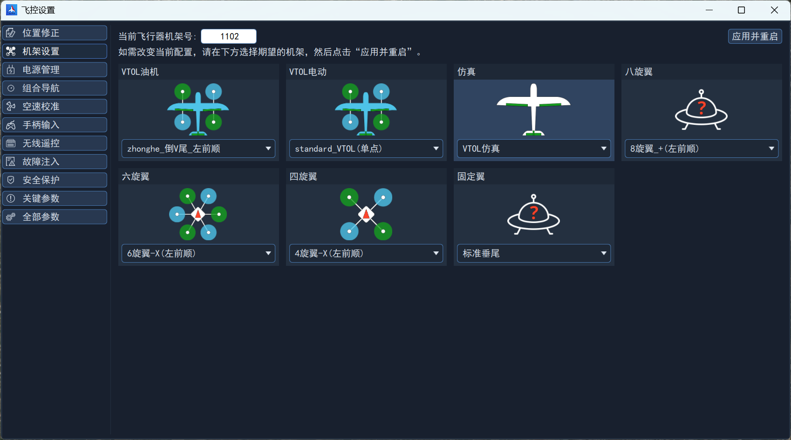
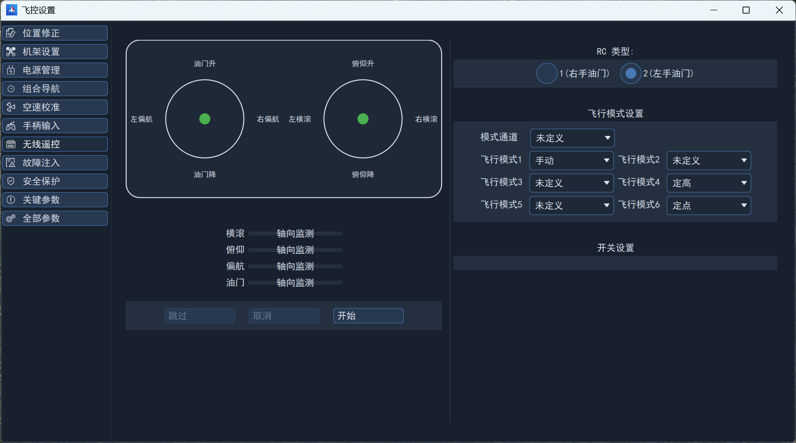
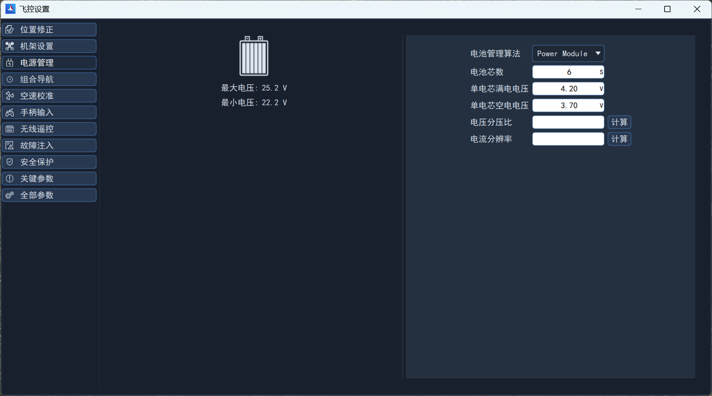

# 基础设置

## 机架设置 {#机架设置}

为了更好的支持和适配不同无人机平台，飞控提供了机架参数，不同机架的核心差异在于动力或舵面的数量及位置、布置的不同，例如垂直尾翼与V尾有较大差异、旋翼电机转向不一样等。

另外根据机架，对区别较大的飞行参数设置了默认值，例如PID内环参数、盘旋半径、前转换超时时间等。

可在飞控设置->机架设置界面选择机架，设置完成后需要重启生效。

## 遥控器设置

在飞控设置->无线遥控界面进行遥控器设置。

### 模式设置

选择一个绑定至三段拨杆的通道映射至模式通道，默认是使用通道5。

默认飞行模式1为手动、飞行模式4为定高、飞行模式6为定点。

### 校准

根据遥控器类型勾选RC模式，点击“开始”按钮，根据提示进行校准即可。

## 电机设置

### 校准

先根据电机产品说明完成校准！

### 确认电机转向

根据机架设置，在地面站界面中确认电机转向。

## 舵面反向设置

舵面反向设置仅对VTOL、固定翼有效，多旋翼机型忽略。  

切至固定翼飞行模态，遥控器解锁后进行舵面控制，若舵面反向，则可通过如下参数设置对应舵面。如果原值为0则改为1，如果原值为1则改为0。

| 参数         | 对应引脚 | 对应设备（根据实际机型确定） |
| ------------ | -------- | ---------------------------- |
| PWM_AUX_REV1 | FCS_CH9  | 左副翼                       |
| PWM_AUX_REV2 | FCS_CH10 | 右副翼                       |
| PWM_AUX_REV3 | FCS_CH11 | 升降左V尾                    |
| PWM_AUX_REV4 | FCS_CH12 | 方向/右V尾                   |

## 舵面配平设置

舵面配平仅对VTOL、固定翼有效，多旋翼机型忽略。

切至固定翼飞行模态，遥控器解锁后进行舵面控制，若舵面不在中位，则可以通过以下参数进行调整。

| 参数          | 对应引脚 | 对应设备（根据实际机型确定） |
| ------------- | -------- | ---------------------------- |
| PWM_AUX_TRIM1 | FCS_CH9  | 左副翼                       |
| PWM_AUX_TRIM2 | FCS_CH10 | 右副翼                       |
| PWM_AUX_TRIM3 | FCS_CH11 | 升降/左V尾                   |
| PWM_AUX_TRIM4 | FCS_CH12 | 方向/右V尾                   |

注意，参数范围为-0.2~0.2，也就是最多只能调整20%，若舵面偏离过大，则需要进行机械调整。

## 校准电池电压

首先使用万用表测量动力电池电压，然后上动力电，进入飞控设置->电源管理界面，输入电池芯数，点击电压分压比计算按钮，输入测量电压后点击计算。

