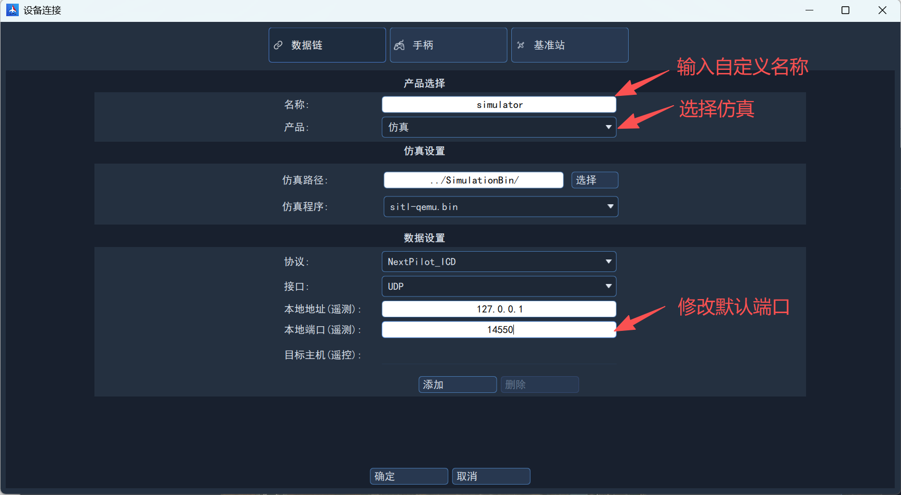
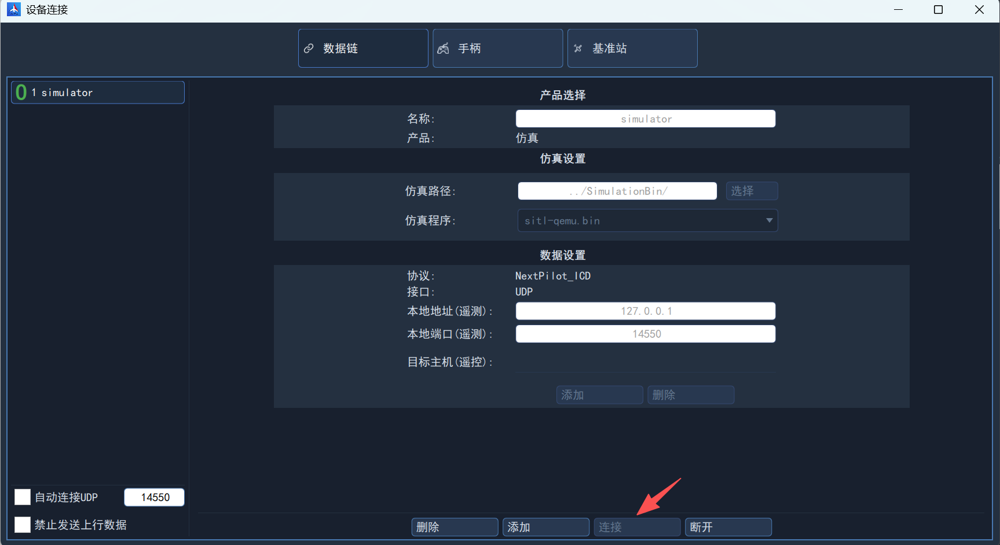
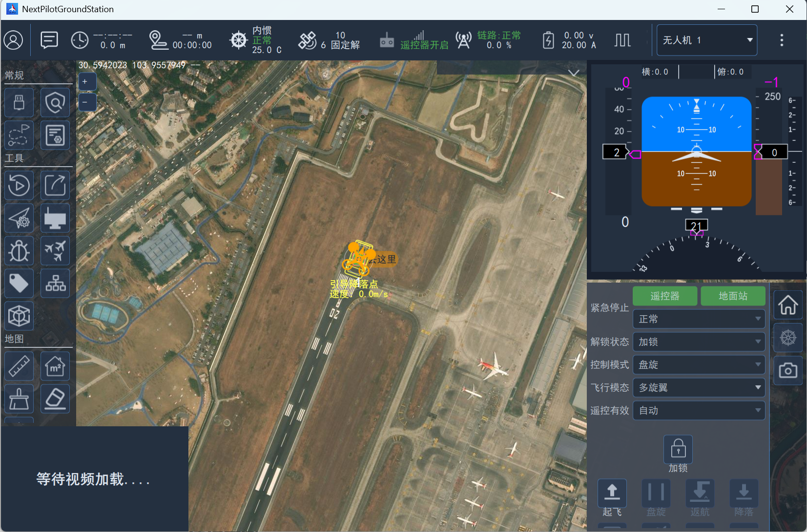
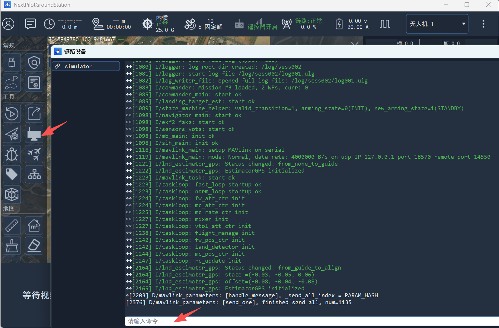
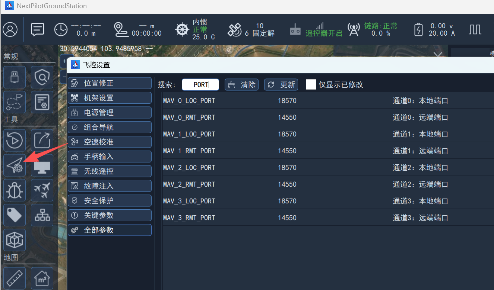
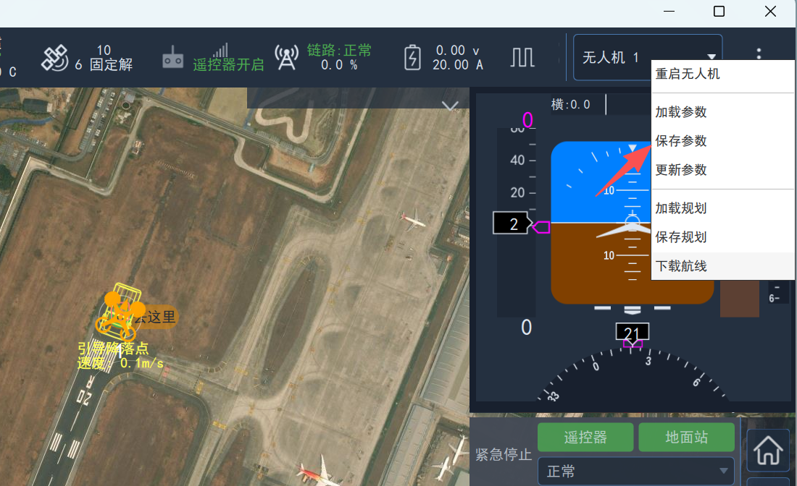
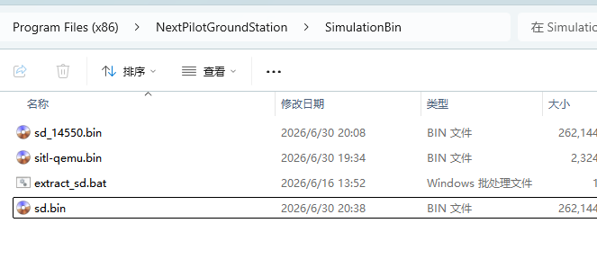

# 软件在环仿真（SITL）

## 简介

软件在环仿真是指在计算机创建一个软件仿真环境，通过创建一个六自由度模型仿真真实飞机，所有的传感器都是虚拟的。

> 注意：软件在环仿真只支持UDP通信连接。

## 仿真环境配置

- 操作系统：Windows；
- 软件：Qemu，地面站。

### 安装Qemu

1. 下载[QEMU for Windows – Installers (64 bit)](https://qemu.weilnetz.de/w64/)，推荐7.1.0之后的版本；
2. 双击安装程序，默认安装在C盘即可；

3. 安装完毕后，将qemu安装目录`C:\Program Files\qemu`添加至环境变量。

### 安装地面站

在[资源下载](../../download/index.md)界面，下载地面站并安装，推荐安装在D盘下。

## 启动仿真

### 创建连接

在地面站左侧侧栏常规区域中，点击`设备连接`并进入设备连接界面后，点击**添加**按钮。


在新创建的设备连接界面中，点击产品下拉列表并选择仿真，修改本地端口为14550，点击确定即可。



然后点击连接，即可启动仿真并建立与仿真无人机的通信连接。



### 主界面

启动仿真后，主界面地面中会显示无人机。

> 默认机架为垂起固定翼。



### qemu终端

在地面站左侧侧栏工具区域中，点击`链路设备`并进入链路设备界面，即可看到仿真终端。

可以在最下方对话框中输入飞控调试命令，如：

- 查看当前进程

  ```bash
  ps
  ```

- 查看mavlink通信状态

  ```bash
  mavlink status info
  ```

## 常用操作

### 修改参数

在工具区域，点击`飞控设置`，在飞控设置界面中点击**全部参数**。输入关键字查找对应参数。



### 保存参数

点击右上角选择**保存参数**。



### 日志查看

在[SITL仿真脚本](../../download/index.md#SITL相关脚本)章节中，下载日志提取脚本extract_sd.bat，然后将其存放在地面站安装根目录下的SimulationBin文件夹中，新拷贝sd_14550.bin并命名为sd.bin。



双击extract_sd.bat脚本，即可解压并在当前目录创建sd文件夹，可在该文件夹中查找飞行日志。

> 运行extract_sd.bat脚本前，需要安装7-Zip.exe软件，安装至默认路径即可！
