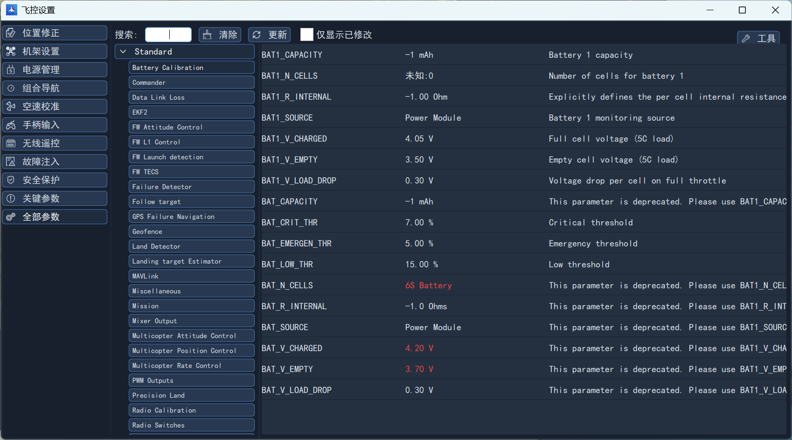
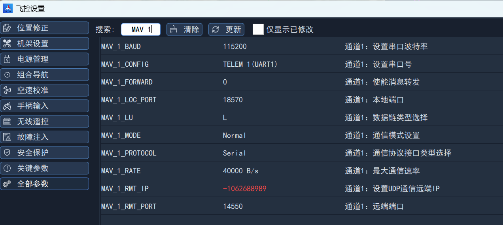
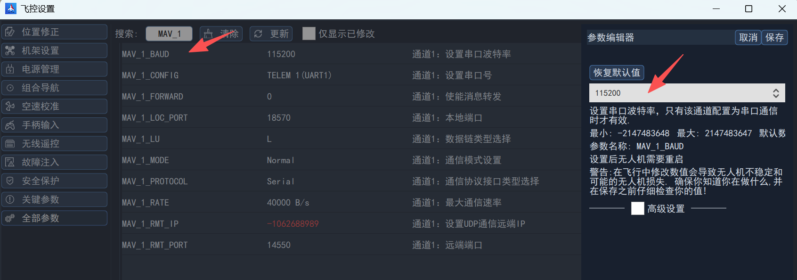
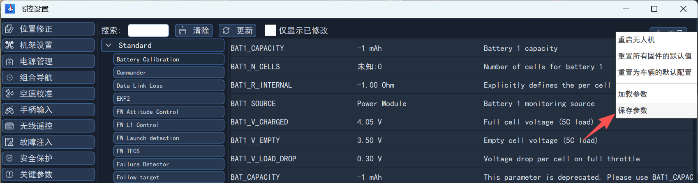
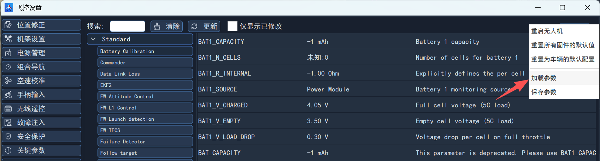

# 参数基本操作

## 简介

NextPilot飞控具备强大的参数管理功能，通过参数配置来控制飞控的“行为”。

在地面站主界面左侧侧栏工具区域内，点击并进入`飞控设置`界面，选择全部参数，即可完成搜索、查看、设置、保存、加载参数等操作。

## 搜索与查看参数

根据飞控功能模块，对参数进行了分类，可选择类别查看对应功能的所有参数。也可以在搜索框输入关键字查找相关参数。

## 修改参数

点击参数，即可在右侧弹出的参数编辑器中选择/更改参数。然后点击保存即可。

## 保存至文件

点击右上方`工具`按钮，选择保存参数，即可将当前参数保存至本地文件。

## 从文件加载参数

点击右上方`工具`按钮，选择加载参数，即可将选择本地参数文件，加载完成后将参数写入飞控。

## 通过控制台查看和修改参数

在外场调试中，可通过连接飞控控制台串口（默认RS422-4）进行查看和修改参数。可打开MobaXterm等软件，创建串口连接后通过如下命令进行操作：

**查看参数**：param show [参数名]

这里参数名可以是具体名称，也支持正则表达式。例如：

- 查看无人机ID：param show MAV_SYS_ID；
- 查看通信通道1的所有配置：param show MAV_1*。

**设置参数**：param set [参数名] [参数值]

例如：param set MAV_SYS_ID 2

