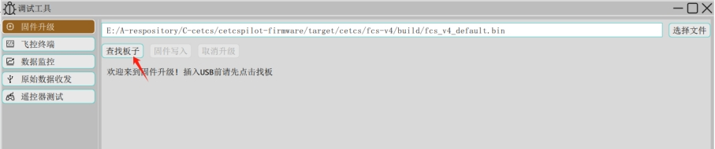

# 烧录固件

> 由于导航飞控内置了两个主控芯片，一个用于运行飞控程序，一个用于运行导航程序。通过FCS-USB烧录飞控固件，通过INS-USB烧录导航固件。出厂默认烧录最新的固件，由于飞控程序会频繁更新，两个固件版本对应关系请在[资源下载](../../download/index.md)中详细了解。

## 准备

准备如下内容：

1. 飞控固件，在[资源下载](../../download/index.md)中下载相应版本。
2. 导航飞控，请在[产品中心](../../product/index.md)查看。
3. 调试板硬件（如果没有调试板或飞控以及装机，则需要自行根据飞控接口线序表完成USB下载接口的连接）。

## 选择文件

​  打开地面站，在左侧侧栏内的工具区域，点击`调试工具`并选择`固件升级`，在固件升级界面，点击“选择文件”按钮，在对话框中选择目标固件即可，文本框中显示固件路径，如下图所示：

XXX需替换

## 查找板子

​  点击查找板子，如下图所示：

XXX需替换

​  将飞控FCS-USB口插入计算机，地面站会立即识别并显示相关信息。

## 固件写入

​  然后点击固件写入即可开始固件擦除、固件烧写流程。

## 下载飞控日志

​  参考固件烧写步骤，完成查找板子步骤后，飞控会创建一个虚拟SD卡并挂载至计算机，点开文件资源管理器，然后打开SD卡设备即可看到日志文件目录。

​  根据日期创建文件夹，每个文件夹存放当天所有日志，日志文件以日期命名，例如20250716_144326.ulg。
