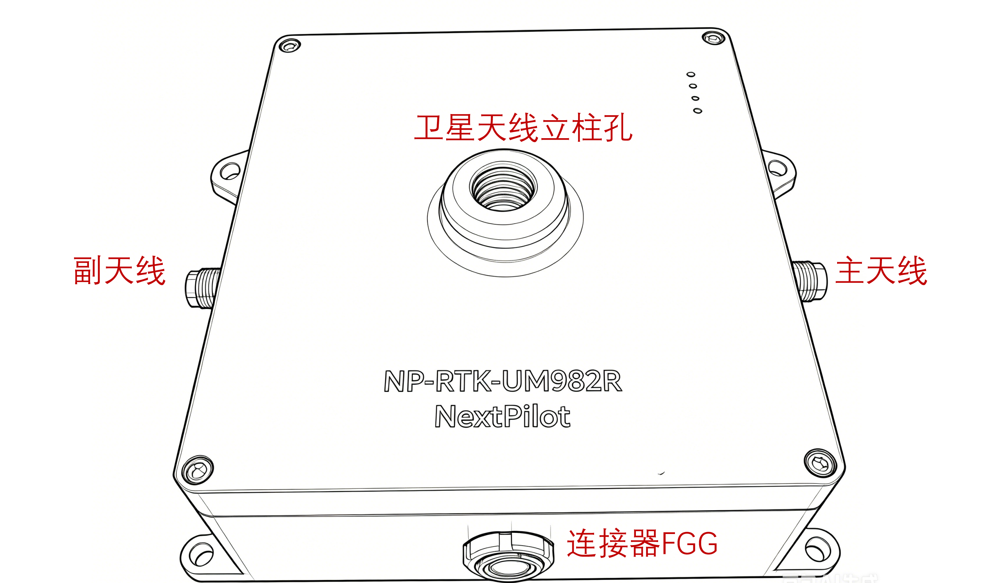

# 产品中心

NextPilot 提供一系列高性能、高可靠性的无人系统核心组件，覆盖飞行控制、大气传感与差分定位三大领域。

| 产品型号 | 产品名称 | 核心功能 |
|:---------|:---------|:---------|
| __NP-FCC-H50__ | 导航飞控计算机 | 导航、制导与控制核心 |
| __NP-ADS-H50__ | 大气数据计算机 | 空速、气压高度、温度测量 |
| __NP-BASE-H50__ | 地面差分基准站 | RTK 差分定位基准 |

- {: style="height:160px;margin-bottom:0.5rem" }

    ## __NP-FCC-H50__{: .product-title }

    ---

    新一代高性能导航飞控计算机，集成双频RTK、IMU冗余阵列和工业级处理器，为无人系统提供精准的导航、制导与控制。

    - :material-check-bold: 双频 RTK 厘米级定位
    - :material-check-bold: 三冗余 IMU 阵列
    - :material-check-bold: 工业级宽温处理器
    - :material-check-bold: 丰富的外部接口扩展

    [:octicons-arrow-right-24: 了解更多](01.飞行控制计算机/index.md)

- {: style="height:160px;margin-bottom:0.5rem" }

    ## __NP-ADS-H50__{: .product-title }

    ---

    高精度数字空速计，采用差压传感与温度补偿技术，精确测量空速、气压高度与温度，为飞行器提供关键大气数据。

    - :material-check-bold: 高精度差压传感器
    - :material-check-bold: 全温区温度补偿
    - :material-check-bold: 静压 / 动压双路测量
    - :material-check-bold: 数字通信接口

    [:octicons-arrow-right-24: 了解更多](03.大气数据计算机/index.md)

- {: style="height:150px;margin-bottom:0.5rem" }

    ## __NP-BASE-H50__{: .product-title }

    ---

    便携式地面差分基准站，支持RTCM差分数据输出，配合机载RTK模块实现厘米级动态定位精度。

    - :material-check-bold: 全星座多频点支持
    - :material-check-bold: RTCM 3.x 差分数据输出
    - :material-check-bold: 4G / Wi-Fi / 数传多链路
    - :material-check-bold: IP67 防护等级

    [:octicons-arrow-right-24: 了解更多](05.地面差分基准站/index.md)

