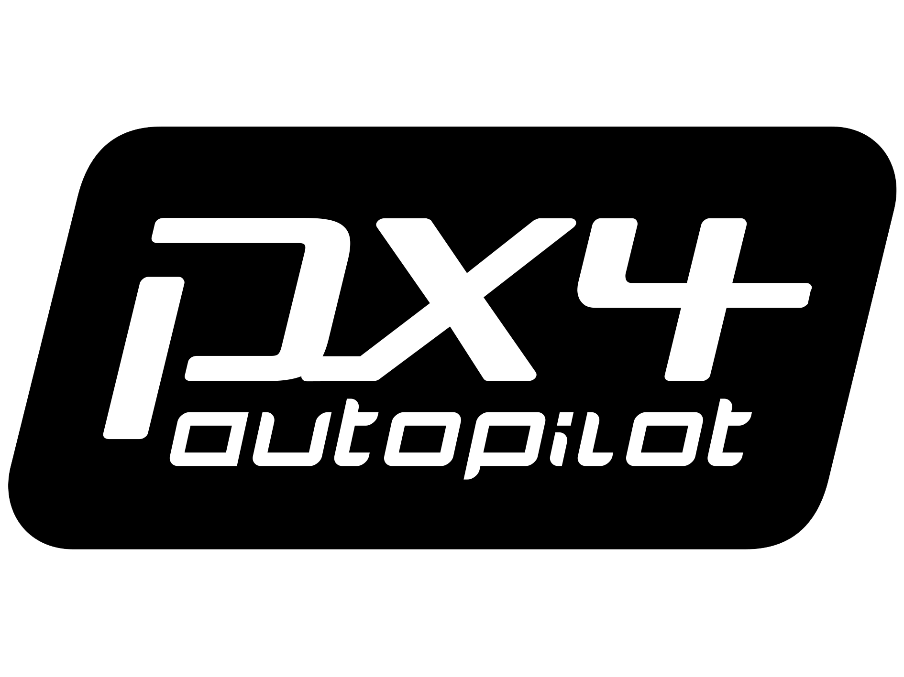

# 解决方案

## 气动优化设计

## 导航飞控开发

- [PX4-Autopilot](https://github.com/px4/px4-autopilot.git)、[QGroundControl](https://github.com/mavlink/qgroundcontrol.git)、[MAVSdk](https://github.com/mavlink/mavsdk.git) 定制二次开发

 

## 机载智能应用

- 垂起无人机舰载自主起降解决方案
- 多旋翼/固定翼集群编队控制解决方案